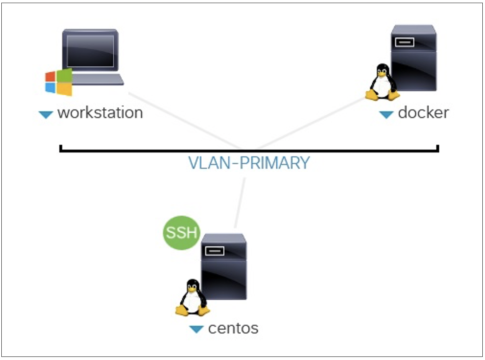
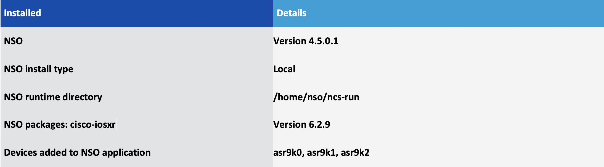

# HOLOPS-1803

## NSO Service Lifecycle Management

### Weigang Huang – Cusomter Delivery Software Architect

### Andrew Bond – Cusomter Delivery Software Architect

Introduction
============

Learning Objectives
===================

Upon completion of this lab, you will be able to:

-   Use Cisco Network Services Orchestrator (NSO) to create, deploy and
    test a service package (L2VPN).

-   Understand the brownfield service deployment challenges.

-   Discover and reconcile pre-existing L2VPN services manually

-   Create an action to discover and reconcile the pre-existing L2VPN
    services automatically.
    
This lab highlights the following features:

-   NSO service customization
-   NSO service reconciliation
  

Intended Audience
=============

**IMPORTANT!** This lab assumes the user meets the following prerequisites:

-   Basic understanding of network orchestration, NETCONF/Yang

-   Basic knowledge of Cisco NSO, including knowledge of the NSO maagic and maapi APIs

-	Basic NSO service reconcilation knowledge ([Presentation slides available for downloading](https://github.com/weiganghuang/holops-1803/blob/master/BRKNMS-2805.pptx))
- (Optional) Python programming experience

Overview
========

As an industry leading orchestration platform, the Cisco Network Services Orchestrator (NSO) is widely used to provide service lifecycle orchestration for hybrid networks. While new services are deployed using NSO service packages, service providers normally have a brownfield network, in which there are pre-existing configurations in the network orchestrated by legacy tools. For a brownfield network, NSO must discover and reconcile pre-existing services.
In this lab, you will create a simple L2VPN service package to configure Layer 2 Transport encapsulation on Bundle Ethernet sub-interfaces; you will also discover and reconcile pre-existing L2VPN services from the network.
The network is composed of simulated NSO NETSIM ASR devices (Cisco IOS-XR). You will create L2VPN services from CE-PE. This lab focuses on PE configuration. To simulate a brownfield network, the PE devices are populated with pre-existing L2VPN services

TOPOLOGY
========

This content includes preconfigured users and components to illustrate the scripted scenarios and features of the solution.

### dCloud Topology

### Logical Topology

The NSO application is pre-installed on a Linux VM, with the details shown in the table below. The NSO runtime directory is set to **/home/nso/ncs-run**. The NSO runtime directory keeps the NSO’s database, state files, logs and other files. If at any time you find you want to start NSO, make sure that you are at the NSO runtime directory prompt.

### NSO Server Installation and Setup Details

The lab contains 5 scenarios.

-   Scenario 1: Verify lab set-up.

-   Scenario 2: Create NSO service package for L2VPN.

-   Scenario 3 and 4: Discover/reconcile pre-existing L2VPN services,
    manually. 
    
    - Scenario 3: Create L2VPN service instances for
    pre-existing configuration. 
    - Scenario 4: Complete the service
    discovery by resetting the reference count.

-   Scenario 5 (optional): Discover/reconcile pre-existing L2VPN services,
    automatically, through NSO’s northbound api MAAPI (Management Agent
    API), and Maggic API.

To start the lab, click the following links for instructions.

 [Scenario 1 Verify Lab Setup](https://github.com/weiganghuang/HOLOPS-1803/blob/master/task0.md)
-----------------------------------
 [Scenario 2 Create L2VPN Service Package](https://github.com/weiganghuang/HOLOPS-1803/blob/master/task1.md)
-------------------------------------

[Scenario 3 Service discovery and reconciliation A: Create L2Vpn service instances from pre-existing configuration](https://github.com/weiganghuang/HOLOPS-1803/blob/master/task2.md)
--------------------------------------------------

[Scenario 4 Service discovery and reconciliation B: Reset reference count](https://github.com/weiganghuang/HOLOPS-1803/blob/master/task3.md)
-----------------------------

[Scenario 5 (Optional): Create an NSO action to discover pre-existing L2VPN service instances automatically](https://github.com/weiganghuang/HOLOPS-1803/blob/master/task4.md)
------------------------------