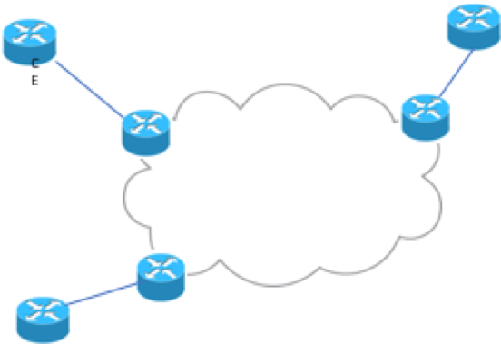
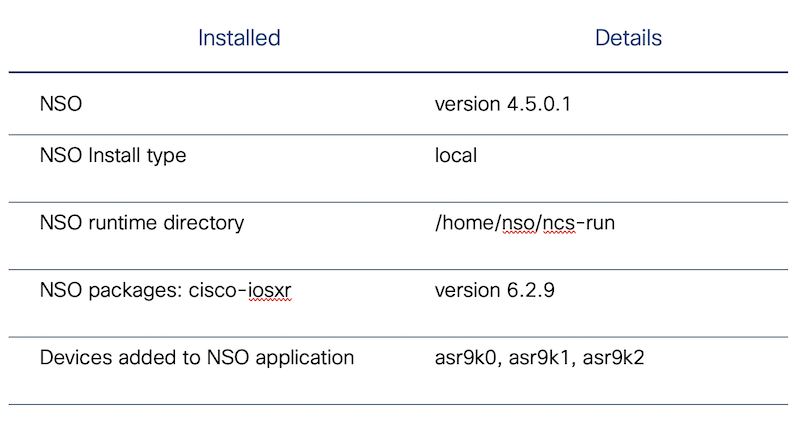

# LTRNMS-2700

## NSO: Dealing with Brownfield, Deploy, Discover and Reconcile L2VPN Services

### Weigang Huang – Business Developer Manager

### Andrew Bond – Software Architecture

Introduction
============

Learning Objectives
===================

Upon completion of this lab, you will be able to:

-   Use Cisco Network Services Orchestrator (NSO) to create, deploy and
    test a service package (L2VPN).

-   Understand the brownfield service deployment challenges.

-   Discover and reconcile pre-existing L2VPN services manually

-   Create an action to discover and reconcile the pre-existing L2VPN
    services automatically.

Pre-requisite
=============

-   Basic understanding of network orchestration, NETCONF/Yang

-   Basic knowledge of Cisco Network Services Orchestrator (NSO)

Overview
========

As an industry leading orchestration platform, NSO is widely used to
provide service lifecycle orchestration for hybrid networks. While new
services are deployed using NSO service packages, service providers
normally have brownfield network, in which there are pre-existing
configuration in the network orchestrated by legacy tools. For
brownfield network, NSO needs to discover and reconcile pre-existing
services.

In this lab, you will create a simple L2VPN service package to configure
Layer 2 Transport encapsulation on Bundle Ethernet sub-interfaces; you
will also discover and reconcile pre-existing L2VPN services from the
network.

The following figure illustrates the network topology. The network is composed of
simulated NSO NETSIM ASR devices (Cisco IOS-XR). You will create L2VPN
services from CE-PE. This lab focuses on PE configuration. To simulate
the brownfield network, the PE devices are populated with pre-existing
L2VPN services.

NSO application is pre-installed on Linux VM, with the details as following:

NSO runtime directory is set to `/home/nso/ncs-run` (NSO
runtime directory is to keep NSO’s database, state files, logs and other
files. At any time if you need to start NSO, make sure that you are
situated at NSO runtime directory)

The lab contains 5 tasks.

-   Task 0: Verify lab set-up.

-   Task 1: Create NSO service package for L2VPN.

-   Task 2 and Task 3: Discover/reconcile pre-existing L2VPN services,
    manually. Task 2 is to create L2VPN service instances for
    pre-existing configuration. Task 3 is to complete the service
    discovery by resetting the reference count.

-   Task 4: Discover/reconcile pre-existing L2VPN services,
    automatically, through NSO’s northbound api MAAPI (Management Agent
    API), and Maggic API.

To start the lab, click the following links for instructions.

 [Task0 Verify Lab Setup](https://github.com/weiganghuang/LTRNMS-2700/blob/master/task0.md)
-----------------------------------
 [Task1 Create L2VPN Service Package](https://github.com/weiganghuang/LTRNMS-2700/blob/master/task1.md)
-------------------------------------

[Task2 Service discovery and reconciliation A: Create L2Vpn service instances from pre-existing configuration](https://github.com/weiganghuang/LTRNMS-2700/blob/master/task2.md)
--------------------------------------------------

[Task3 Service discovery and reconciliation B: Reset reference count](https://github.com/weiganghuang/LTRNMS-2700/blob/master/task3.md)
-----------------------------

[Task4 (Extra Credit): Create an NSO action to discover pre-existing L2VPN service instances automatically](https://github.com/weiganghuang/LTRNMS-2700/blob/master/task4.md)
------------------------------