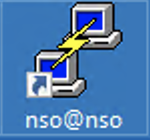

HOLOPS-1803
===========

**[Lab Introduction](https://github.com/weiganghuang/HOLOPS-1803/blob/master/HOLOPS-1803.md)**

**[Next Scenario](https://github.com/weiganghuang/HOLOPS-1803/blob/master/task1.md)**

# Scenario 1 Verify Lab Setup
--------------------


### Steps 

1. On the remote desktop, double-click the **nso@nso** click  icon to open a PuTTY connection to the NSO VM.
2. Enter the following commands to fully initialize all elements of the lab. The initialization takes approximately five minutes.


    ```
    [nso@nso ~]$ ansible-playbook ~/ansible/set-lab.yml
    ```
1.  Enter the following commands to verify the NSO version.

    ```
    [nso@nso ~]$ cd ncs-run
    [nso@nso ncs-run]$ pwd
    [nso@nso ncs-run]$ ncs --version
    ```
    Sample output:
    
    ```
    [nso@nso]$ cd ncs-run
    [nso@nso ncs-run]$ pwd
    /home/nso/ncs-run
    [nso@nso ncs-run]$ ncs --version
    4.5.0.1
    ```
 

1.  Enter the following commands to access the CLI and check the pre-loaded packages in your NSO application.
    
    ```
    [nso@nso ncs-run]$ ncs_cli -u admin
    admin connected from 198.18.133.252 using ssh on cl-lab-211
    admin@ncs> show packages package package-version
    ```
    Sample output:
    
    ```
    admin@ncs> show packages package package-version
                 PACKAGE
    NAME         VERSION
    ----------------------
    cisco-iosxr  6.2.9    
    ```
    
    Check package operation status:
    
    ```
    admin@ncs> show packages package oper-status
    ```
    
    Sample output:
    
    ```
    nso@ncs> show packages package oper-status
    packages package cisco-iosxr
    oper-status up
    [ok][2020-12-11 13:56:09]
  
    ```
    
    **Make sure the version of cisco-iosxr is 6.2.9 and the
    oper-status is up**

1.  Verify that the NSO instance contains three PE devices (asr9k0, asr9k1, asr9k2).

    ```
    admin@ncs> show devices brief
    ```
    Sample output:
    
    ```
    admin@ncs> show devices brief
	 NAME    ADDRESS    DESCRIPTION  NED ID
	 --------------------------------------------
	 asr9k0  127.0.0.1  -            cisco-ios-xr
	 asr9k1  127.0.0.1  -            cisco-ios-xr
	 asr9k2  127.0.0.1  -            cisco-ios-xr
    [ok][2020-12-12 15:12:05]

    ```

1.  Sync up the devices to bring the PE devices configuration into NSO’s
    device model.

     ```
     admin@ncs> request devices sync-from
     ```

     Sample output:
     
      ```
     admin@ncs> request devices sync-from
     sync-result {
    	device asr9k0
    	result true
	  }
	  sync-result {
    	device asr9k1
    	result true
     }
     sync-result {
    	device asr9k2
    	result true
	  }

     ```
     
2. Enter the following commands to return to the nso@nso prompt.

   ```
   admin@ncs> exit
   [nso@nso ncs-run]$
   ```

**This concludes scenario 1. Next Scenario: Create a service package, continue with to the next scenario: Create L2VPN Service Package**

**[Next Scenario](https://github.com/weiganghuang/HOLOPS-1803/blob/master/task1.md)**

**[Lab Introduction](https://github.com/weiganghuang/HOLOPS-1803/blob/master/HOLOPS-1803.md)**


  

