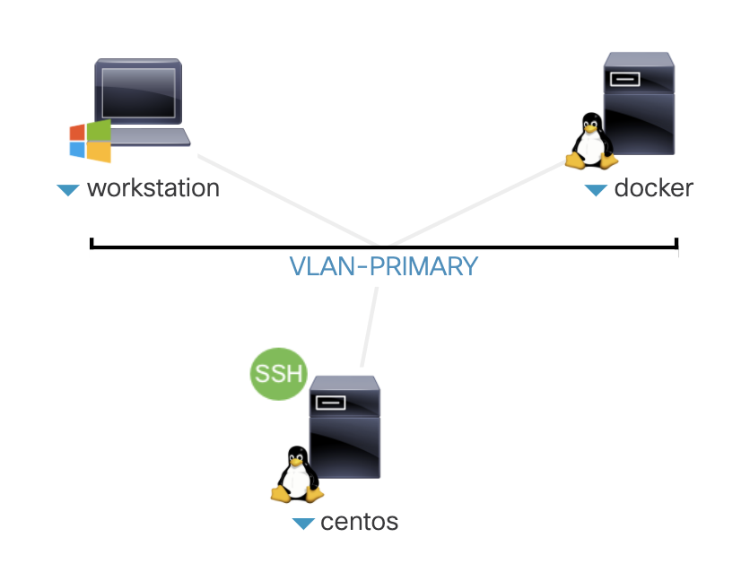
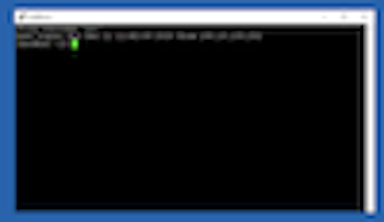

HOLOPS-1803
===========

# Task 0 Verify Lab Setup
----------------

In this task, you verify lab setup access

You session setup:



###  Access Information

(revise this section after dCloud setup is finalized)
        

### Access Lab Setup. 

1. Once you RDP to windows workstation, access NSO application VM:
    
    Click from desktop, to open a putty connection to NSO VM

2. Expected result:



### Validate the setup

Follow the following instruction. 

1.  Check NSO version.

    ```
    [nso@nso ~]$ cd ncs-run
    [nso@nso ncs-run]$ pwd
    [nso@nso ncs-run]$ ncs --version
    ```
    Sample output:
    
    ```
    [nso@nso]$ cd ncs-run
    [nso@nso ncs-run]$ pwd
    /home/nso/ncs-run
    [nso@nso ncs-run]$ ncs --version
    4.5.0.1
    ```

1.  Make sure NSO is running:

    ```
    [nso@nso ncs-run]$  ncs --status | head
    ```
    Sample output:
    
    ```
    [nso@nso ncs-run]$ ncs --status | head
    vsn: 4.5.0.1
    SMP support: yes, using 4 threads
    Using epoll: yes
    available modules:        
    ....
    ```
    
    **Note: if you get “connection refused”, start NSO application:**
    
    ```
    [nso@nso ncs-run]$  ncs --status | head
    connection refused (status)
    [nso@nso]$ cd ncs-run
    [nso@nso ncs-run]$ pwd
    /home/nso/ncs-run
    [nso@nso ncs-run]$ ncs
    ```
    **Note: If you get errors for “ncs” command, make sure you are in
    your nso runtime directory: `/home/nso/ncs-run`**

1.  Check pre-loaded packages in your NSO application.

    Check package version
    
    ```
    [nso@nso ncs-run]$ ncs_cli -u admin
    admin connected from 128.107.235.22 using ssh on cl-lab-211
    admin@ncs> show packages package package-version
    ```
    Sample output:
    
    ```
    admin@ncs> show packages package package-version
                    PACKAGE
    NAME            VERSION
    -------------------------
    cisco-iosxr-cli-6.6  6.6.0.1
    [ok][2017-04-28 07:12:36]
    ```
    
    Check package operation status:
    
    
    ```
    admin@ncs> show packages package oper-status
    ```
    
    Sample output:
    
    ```
    packages package cisco-iosxr-cli-6.6
      oper-status up
    [ok][2017-06-11 06:35:51]  
    ```
    **Make sure the version of cisco-iosxr-cli-6.6 is 6.6.0.1 and the
    oper-status is up**

1.  Check the NSO instance contains 3 PE devices, asr9k0, asr9k1,
    asr9k2.

    ```
    admin@ncs> show devices brief
    ```
    Sample output:
    
    ```
    NAME    ADDRESS    DESCRIPTION  NED ID
    --------------------------------------------
    asr9k0  127.0.0.1  -            cisco-iosxr-cli-6.6
    asr9k1  127.0.0.1  -            cisco-iosxr-cli-6.6
    asr9k2  127.0.0.1  -            cisco-iosxr-cli-6.6 
    [ok][2017-06-11 12:30:02]
    ```

1.  Sync up the devices to bring the PE devices configuration into NSO’s
    device model.

     ```
     admin@ncs> request devices sync-from
     ```

     Sample output:
     
      ```
     admin@ncs> request devices sync-from
     sync-result {
    	device asr9k0
    	result true
	  }
	  sync-result {
    	device asr9k1
    	result true
     }
     sync-result {
    	device asr9k2
    	result true
	  }

     ```
     
2. Exit from cli

   ```
   admin@ncs> exit
   [nso@cl-lab-221 ncs-run]$
   ```
   
   
You have finished Task 0: Verify Lab Setup. Now you are ready to move on
to the next Task: Create a service package:

 [Task1 Create L2VPN Service Package](https://github.com/weiganghuang/HOLOPS-1803/blob/master/task1.md)
------

  

