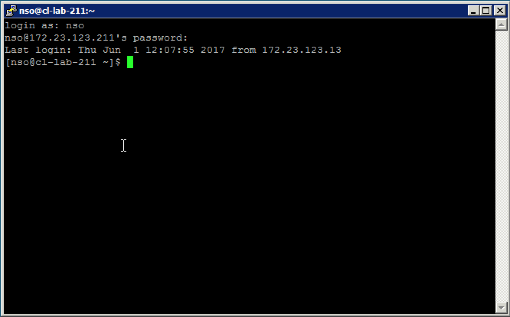

LABNMS-2500
===========

# Task 0 Verify Lab Setup
----------------

In this task, you will verify that you can access lab setup via jump
start server. 

###  Access Information

Note, jump start server is shared. You should login with your own user id. Each lab user will have his/her own NSO application VM.

  * Jump start window server: 128.107.235.22

    * login: WEIGANG\labuser[1-20]
    * password: c1sco123\#
  
  * NSO VM for each server, (putty from Jump start server)
    *  IP:   172.23.123.2[11-30]        
    *  user: nso
    *  password: cisco123           

### Access Lab Setup. 

1.  Access lab jump start server via Remote Desk Top. Launch Remote Desk Top, enter credentials (Jump start server, username is
    WEIGANG\\labuser1, WEIGANG\\labuser2, and etc) 
    
2.  Access NSO application VM from Jump Start windows server, 
    
    click  from desktop, to open a putty connection, enter NSO VM IP address (172.23.123.211, ....)
    
    **Make sure you entered the ip address assigned to you.
    (172.23.123.211 for labuser1, 172.23.123.212 for labuser2, ….)**


3.  Enter credentials as listed in **Table 2 Lab access information:**
    (nso/cisco123):

  

### Validate the setup

Follow the following instruction. 

1.  Check NSO version.

    ```
    [nso@cl-lab-211]$ cd ncs-run
    [nso@cl-lab-211 ncs-run]$ pwd
    /home/nso/ncs-run
    [nso@cl-lab-211 ncs-run]$ ncs --version
    5.0.20181016.1
     ```

1.  Make sure NSO is running, if you get “connection refused”, start NSO application:

    ```
    [nso@cl-lab-211 ncs-run]$ ncs --status
    connection refused (status)
    [nso@cl-lab-211]$ cd ncs-run
    [nso@cl-lab-211 ncs-run]$ pwd
    /home/nso/ncs-run
    [nso@cl-lab-211 ncs-run]$ ncs
    ```

    **Note: If you get errors for “ncs” command, make sure you are in
    your nso runtime directory: `/home/nso/ncs-run`**

1.  Check pre-loaded packages in your NSO application.

    ```
    [nso@cl-lab-211 ncs-run]$ ncs_cli -u admin

    admin connected from 128.107.235.22 using ssh on cl-lab-211
    admin@ncs> show packages package package-version
                PACKAGE
    NAME            VERSION
    -------------------------
    cisco-iosxr-cli-6.6  6.6.0.1
    [ok][2017-04-28 07:12:36]
    admin@ncs> show packages package oper-status
    packages package cisco-iosxr-cli-6.6
    oper-status up
    [ok][2017-06-11 06:35:51]  
    ```

    **Make sure the version of cisco-iosxr-cli-6.6 is 6.6.0.1 and the
    oper-status is up**

1.  Check the NSO instance contains 3 PE devices, asr9k0, asr9k1,
    asr9k2.

    ```
    [nso@cl-lab-218 ~]$ ncs_cli -u admin

    admin connected from 172.23.123.13 using ssh on cl-lab-218
    admin@ncs> show devices brief
    NAME    ADDRESS    DESCRIPTION  NED ID
    --------------------------------------------
    asr9k0  127.0.0.1  -            cisco-iosxr-cli-6.6
    asr9k1  127.0.0.1  -            cisco-iosxr-cli-6.6
    asr9k2  127.0.0.1  -            cisco-iosxr-cli-6.6 
    [ok][2017-06-11 12:30:02]
    ```

1.  Sync up the devices to bring the PE devices configuration into NSO’s
    device model.

     ```
     admin@ncs> request devices sync-from
     sync-result {
    	device asr9k0
    	result true
	  }
	  sync-result {
    	device asr9k1
    	result true
     }
     sync-result {
    	device asr9k2
    	result true
	  }

     ```

You have finished Task 0: Verify Lab Setup. Now you are ready to move on
to the next Task: Create a service package:

 [Task1 Create L2VPN Service Package](https://github.com/weiganghuang/labnms-2500/blob/master/task1.md)
------

  

