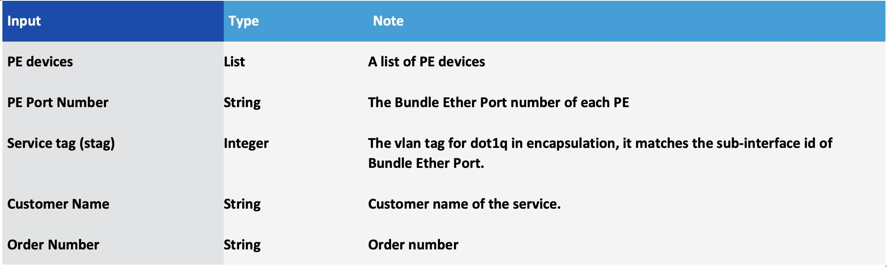
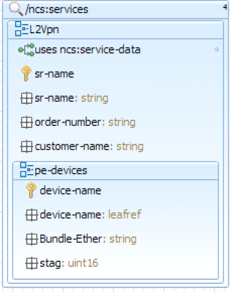
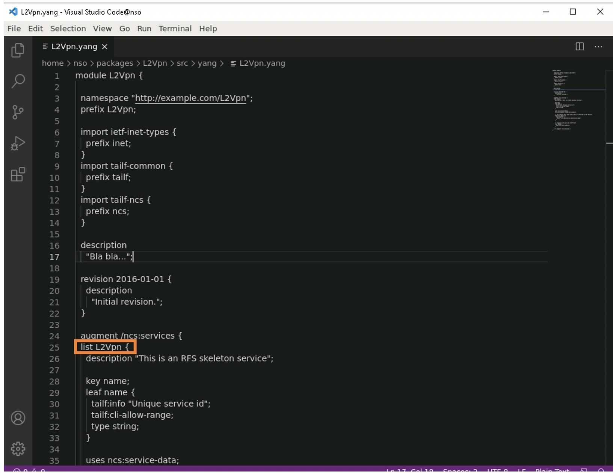
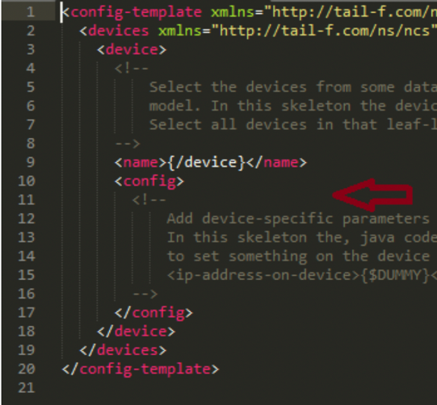
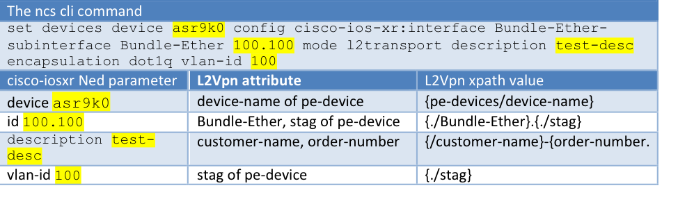

LABNMS-2500
===========

Task 1 Create L2VPN Service Package
----------------------------
 

Requirements of the service package:

* The service gets a list of PE’s. 
* Each PE contains a Layer 2 transport Bundle-Ethernet sub-interface, where PE
Port number is to identify the Bundle-Ethernet interface. 
* Service tag (stag) is the VLAN id to be encapsulated. stag is also used as
sub-interface id of Bundle-Ethernet port. 
* Customer name and order number
need to be put as the description of the sub-interfaces.
* Service Attributes:




* CLI's to be configured on PE for L2VPN
Service

  ```
  interface Bundle-Ether <PE Port number>.<stag>l2transport 
  description "<customer name>-<order number>"
  encapsulation dot1q <stag>
  ```

In this task, you will create a service package skeleton, and a service
Yang model to capture the service attributes. You will
then create service to device mapping to support the configuration of
CLIs. At the end, you will deploy the service package
onto your NSO host.

The service YANG model:



As shown in the
diagram, L2Vpn is modelled as a list of ncs services. `sr-name` is the
key of the list. Each L2Vpn contains leaf nodes of `order-number` and
`customer-name`. In addition, it contains a list of `pe-devices`, each with
a `Bundle-Ether` port and an `stag` (service tag).


### Create Service Skeleton 

1.  From NSO application VM, create a service skeleton package using
    `ncs-make-package` command, name it `L2Vpn`.
    ```
    [nso@cl-lab-211]$ mkdir ~/packages
    [nso@cl-lab-211 packages]$ cd ~/packages
    [nso@cl-lab-211 packages]$ ncs-make-package --service-skeleton python-and-template --augment /ncs:services L2Vpn

    ```     

1.  “ncs-make-package” creates a directory structure (`L2Vpn`), and skeleton of service files, let's check it out:

    ```
    [nso@cl-lab-211 packages]$ cd ~/packages/L2Vpn
    [nso@cl-lab-211 L2Vpn]$ ls
    package-meta-data.xml python README src templates test
    ```

1.  Inspect the skeleton files, make sure files `Makefile`, `L2Vpn.yang` and
    `L2Vpn-template.xml` are created:

    ```
    [nso@cl-lab-211 L2Vpn]$ ls src  
    Makefile yang
    [nso@cl-lab-211 L2Vpn]$ ls src/yang 
    L2Vpn.yang
    [nso@cl-lab-211 L2Vpn]$ ls templates/
    L2Vpn-template.xml
    ```

### Update the auto-generated L2Vpn.yang

The skeleton of `L2Vpn.yang` file is auto-generated as part of
`ncs-make-package` command. In this step, you will update the
auto-generated Yang file, `L2Vpn.yang` to model the L2Vpn service.

**Option 1: Edit `~/packages/L2Vpn/src/yang/L2Vpn.yang` from NSO server,
using `vi` for example;**

**Option 2: Copy file `~/packages/L2Vpn/src/yang/L2Vpn.yang` from NSO
server to jump server using `WinScp`
(****). Edit the file using editors such as
Sublime (** **), or
Notepad++(****). If you take Option 2, remember copy
the file back to NSO server.**

1.  The auto-generated `L2Vpn.yang` file contains several skeleton blocks.
    You need to update L2Vpn block to add service attributes. Modify the
    generated Yang file, locate the block starts with “list L2Vpn”:

    

1.  Change “`name`” to “`sr-name`”:

    ```
    augment /ncs:services {
        list L2Vpn {
            description "This is an RFS skeleton service";
            uses ncs:service-data;
            ncs:servicepoint L2Vpn-servicepoint;
            key sr-name;
            leaf sr-name {
                tailf:info "Unique service name";
                tailf:cli-allow-range;
                type string;
            }
    ```

1.  Add other service attributes: `order-number`, `customer-name`, and
    `pe-devices` after `sr-name` block. Note, attribute `pe-devices` is a list
    with `device-name` as the key. We use leaf reference (`leafref`) points
    to NSO’s device model: (`/ncs:devices/ncs:device/ncs:name`)
    
    ```
    
            leaf order-number {
                type string;
            }
            leaf customer-name {
                type string;
            }
            list pe-devices {
                key device-name;
                leaf device-name {
                    type leafref {
                        path "/ncs:devices/ncs:device/ncs:name";
                    }
                }
    ```
  
1.  Continue adding attributes of pe-device element. (inside the list `pe-devices` block)

    ```
            list pe-devices {
                key device-name;
                leaf device-name {
                    type leafref {
                        path "/ncs:devices/ncs:device/ncs:name";
                    }
                }
                leaf Bundle-Ether {
                    type string;
                }
                leaf stag {
                    type uint16 {
                        range 1..4095;
                    }
                }
            }
        }
    }
    ``` 

1.  Complete content of the file is available at [L2Vpn.yang](https://github.com/weiganghuang/labnms-2500/blob/master/solution/L2Vpn/src/yang/L2Vpn.yang)

    **Note: You can find the solution of the L2Vpn.yang from NSO server,
    at `/home/nso/solution/L2Vpn/src/yang/` for your reference.**

1.  Save the updated L2Vpn.yang file. If you edit the file at jump start
    server, remember to copy back to NSO server
    (.

2.  Compile project L2Vpn at your NSO server.

    ```
    [nso@cl-lab-211 ncs-run]$ cd ~/packages/L2Vpn/src
    [nso@cl-lab-211 src]$ make clean all
    rm -rf ../load-dir java/src//
    mkdir -p ../load-dir
    mkdir -p java/src//
    /home/nso/ncs-4.3.1/bin/ncsc \`ls L2Vpn-ann.yang >/dev/null 2>&1 && echo "-a L2Vpn-ann.yang"\` \\  
    -c -o ../load-dir/L2Vpn.fxs yang/L2Vpn.yang
    ```
    **Note: Make sure there is no compilation errors. Check `L2Vpn.yang`
    from /home/nso/solution/L2Vpn/src/yang/ for your reference**.

### Complete l2vpn template to map service model to device model mapping

You have created the service model in the previous step. Next, L2Vpn
service needs to send the proper CLI’s to PE
devices. In NSO term, this is called service model to device model
mapping.

In most cases, the service to device mapping can be easily implemented
through xml template. You will use this approach for L2Vpn. The skeleton
of mapping template xml file, `L2Vpn-template.xml` is auto generated. In
this step, you will add the contents.

We start with creating a sample Bundle Ether sub-interface
(sub-interface 100.100, with vlan id 100) to a PE through NSO CLI. NSO’s
operation `commit dry-run` will have NSO’s cisco-iosxr Ned calculate the
device CLI’s. `commit dry-run outformat xml` displays the output in xml
format. This output is the starting point of the mapping template.

1.  At NSO server, configure a Bundle Ether
    sub-interface 100.100 to the PE device asr9k0 through nsc cli.
    

    ```
    [nso@cl-lab-211 src]$ ncs_cli -u admin
    admin connected from 128.107.235.22 using ssh on cl-lab-211
    admin@ncs>conf
    Entering configuration mode private 
    [ok][2017-04-29 03:05:47]
    [edit]
    admin@ncs% set devices device asr9k0 config cisco-ios-xr:interface Bundle-Ether-subinterface Bundle-Ether 100.100 mode l2transport description test-desc encapsulation dot1q vlan-id 100
    [ok][2017-04-29 03:07:44]
    [edit] 
    admin@ncs%
    ```

1.  From ncs cli config mode, issue `commit
    dry run outformat xml`. This command will show the configuration
    changes to be sent to device as xml format.

    ```
    admin@ncs% commit dry-run outformat xml
    result-xml {
      local-node {
        data <devices xmlns="http://tail-f.com/ns/ncs">
               <device>
                 <name>asr9k0</name>
                 <config>
                   <interface xmlns="http://tail-f.com/ned/cisco-ios-xr">
                     <Bundle-Ether-subinterface>
                       <Bundle-Ether>
                         <id>100.100</id>
                         <mode>l2transport</mode>
                         <description>test-desc</description>
                         <encapsulation>
                           <dot1q>
                             <vlan-id>100</vlan-id>
                           </dot1q>
                         </encapsulation>
                       </Bundle-Ether>
                     </Bundle-Ether-subinterface>
                   </interface>
                 </config>
               </device>
             </devices>
      }
    }
    [ok][2017-04-29 03:09:22]
    [edit]

    ```

1.  We don’t want to commit the above changes to devices. Exit from ncs
    cli without committing:

    ```
    admin@ncs% exit no
    [ok][2017-06-02 01:47:29]
    admin@ncs> exit
    [nso@cl-lab-211 src]$
    ```

1.  Now let’s complete L2Vpn template file, L2Vpn-template.xml

    **Option 1: Edit ~/packages/L2Vpn/templates/L2Vpn-template.xml from
 NSO server, using `vi` for example;**

    **Option 2: Copy the file
 ~/packages/L2Vpn/templates/L2Vpn-template.xml from NSO server to
  window’s jump server using
  (. Edit the file using editors such as
 Sublime 
 ,
 Notepad++(. If you take Option 2, remember copy the file back to NSO server.**

1.  Edit file ~/packages/L2Vpn/templates/L2Vpn-template.xml. Replace
    the contents of the block of `<config-template
    xmlns="http://tail-f.com/ns/config/1.0">` with the output of `commit
    dry run outformat xml` command  at the previous step:

    


1.  Next you need to plant the service attributes to replace the sample
    parameters used to create the Bundle Ether sub-interface
    (sub-interface 100.100, with vlan id 100). The service attributes
    are identified as an xpath from service root L2vpn, with proper
    syntax (inside {}) and context, summarized:
    
    
    
    The final template file L2Vpn-template.xml should look like the following: 
 
    ```
    <config-template xmlns="http://tail-f.com/ns/config/1.0">
     <devices xmlns="http://tail-f.com/ns/ncs">
       <device>
         <name>{/pe-devices/device-name}</name>
         <config>
           <interface xmlns="http://tail-f.com/ned/cisco-ios-xr">
            <Bundle-Ether-subinterface>
              <Bundle-Ether>
                <id>{./Bundle-Ether}.{./stag}</id>
                <description>{/customer-name}-{/order-number}</description>
                <mode>l2transport</mode>
                <encapsulation>
                  <dot1q>
                    <vlan-id>{./stag}</vlan-id>
                  </dot1q>
                </encapsulation>
              </Bundle-Ether>
            </Bundle-Ether-subinterface>
          </interface>
        </config>
      </device>
    </devices>
    </config-template>
  
    ```
    Complete tempalte file is available at [L2Vpn-template.xml](https://github.com/weiganghuang/labnms-2500/blob/master/solution/L2Vpn/templates/L2Vpn-template.xml)
 
    **You can find the solution template file from
    `~/solution/L2Vpn/templates` of your NSO server, for your
    reference.**

1.  Save `L2Vpn-template.xlm`. If you edit the file from the windows
    jumpstart server, remember to copy the file to NSO server, to
    `~/packages/L2Vpn/templates/`

### Deploy the service package L2Vpn

Now you are ready to deploy the service package to NSO application.

1.  At NSO server, check current packages in your NSO installation, make
    sure cisco-iosxr ned appear under
    `ncs-run/packages`:

    ```
    [nso@cl-lab-211]$ ls –l ~/ncs-run/packages
    lrwxrwxrwx. 1 nso nso 54 Dec 9 04:46 cisco-iosxr-cli-6.6 ->/home/nso/ncs-5.0.1/packages/neds/cisco-iosxr-cli-6.6/
    ```

1.  Make package L2Vpn available for NSO. Creating a symbolic link to
    `L2Vpn` at the `packages` directory of your NSO runtime
    (`/home/nso/ncs-run/packages`):

    ```
    [nso@cl-lab-211]$ cd ~/ncs-run/packages
    [nso@cl-lab-211 packages]$ ln -s /home/nso/packages/L2Vpn/
    [nso@cl-lab-211 packages]$ ls -l
    total 0
    lrwxrwxrwx. 1 nso nso 54 Dec  9 04:46 cisco-iosxr-cli-6.6 -> /home/nso/ncs-5.0.1/packages/neds/cisco-iosxr-cli-6.6/
    lrwxrwxrwx. 1 nso nso 25 Dec  9 08:19 L2Vpn -> /home/nso/packages/L2Vpn/

    ```

    **Note: Make sure you are creating the symbolic link at
    `~/ncs-run/packages directory`.**

1.  From NSO cli (ncs_cli), reload packages to complete the package
    deployment process.

    **Make sure the reload result is true. If you see errors, check the
    solution from ~/packages/solution directory for reference.**

    ```
    [nso@cl-lab-211 ~]$ ncs_cli -u admin
    admin connected from 128.107.235.22 using ssh on cl-lab-211
    admin@ncs> request packages reload 
    >>> System upgrade is starting.
    >>> Sessions in configure mode must exit to operational mode.
    >>> No configuration changes can be performed until upgrade has completed.
    >>> System upgrade has completed successfully.
    reload-result {
    	package L2Vpn
    	result true
	}
	reload-result {
    	package cisco-iosxr-cli-6.6
    	result true
	}
	admin@ncs> show packages package package-version
                     PACKAGE
	NAME                 VERSION
	------------------------------
	L2Vpn                1.0
	cisco-iosxr-cli-6.6  6.6.0.1
	[ok][2018-12-09 08:23:00]

    ```

### Test the service package

At this step, you will test the service package L2Vpn. The NSO running
on the application server has 3 PE devices. You will create a test L2Vpn
service instance.

1.  Create an L2Vpn service instance, name it
    “test”, set customer name as ciscolive, and order-number 123. In
    addition, set pe-devices as asr9k0, Bundle-Ether 100, and stag 100 :

    ```
  	[nso@cl-lab-211 ~]$ ncs_cli -u admin
  	admin connected from 128.107.235.22 using ssh on cl-lab-211
  	admin@ncs>conf
  	Entering configuration mode private
  	[ok][2017-04-29 08:20:16] 
  	[edit] 
  	admin@ncs% set services L2Vpn test customer-name ciscolive order-number 123 pe-devices asr9k0 Bundle-Ether 100 stag 100
  	[ok][2017-04-29 08:21:00]
  	[edit]
	```

1.  Operation “Commit dry run” shows the CLI’s to be configured to
    asr9k0:

  	```
  	admin@ncs% commit dry-run outformat native
	native {
    	device {
        name asr9k0
        data interface Bundle-Ether 100.100 l2transport
              description "ciscolive-123"
              encapsulation dot1q 100
             exit
    	}
	}
	[ok][2017-04-29 08:21:08]
	[edit]
	admin@ncs%  
  	```
1.  Commit the service instance test. After commit, the service instance
    test is persistent in NSO’s in memory database cdb, and the
    cli’s from above are committed to asr9k0.

  	```
  	admin@ncs% commit
	Commit complete.
	[ok][2017-04-29 08:21:18]

	[edit]
	admin@ncs% show services L2Vpn test
	order-number  123;
	customer-name ciscolive;
	pe-devices asr9k0 {
    	Bundle-Ether 100;
    	stag         100;
	}
	[ok][2017-04-29 08:21:33]

	[edit]
	admin@ncs%

  	```

1.  Check device configuration to see the
    intended CLI’s are configured at asr9k0. Open another putty
    terminal, logged in as user nso/cisco123. From NSO application server, connect to the netsim
    device asr9k0 to confirm Bundle-Ether sub-interface, 100.100 is
    created with the correct customer name, order number and vlan tag:

	```
	[nso@cl-lab-211]$ cd ~/ncs-run
	[nso@cl-lab-211 ncs-run]$ ncs-netsim cli-c asr9k0

	admin connected from 128.107.235.22 using ssh on cl-lab-211
	cl-lab-211# show running-config interface Bundle-Ether 100.100
	interface Bundle-Ether 100.100 l2transport
	   description ciscolive-123
 	   encapsulation dot1q 100
	exit
	```

1.  Delete service instance “test” from NSO
    CLI (config mode).

	 Note: you can get back to nso cli config mode by `ncs_cli –u admin`
    followed by `config` from your NSO’s VM, linux prompt.

	 ```
	 admin@ncs% delete services L2Vpn test
	 [ok][2017-04-29 08:42:24]

	 admin@ncs% commit dry-run outformat native
	 native {
    	device {
        name asr9k0
        data no interface Bundle-Ether 100.100 l2transport
    	}
	 }
	 [ok][2017-04-29 08:42:24]

	 [edit]
	 admin@ncs% commit
	 Commit complete.
	 [ok][2017-04-29 08:42:31]

	 [edit]
	 admin@ncs%

  	 ```

1.  Check device configuration to confirm that Bundle-Ether
    sub-interface 100.100 created through service instance test is
    removed. (from the putty terminal, you opened at **4**):

	```
	admin@ncs% show devices device asr9k0 config cisco-ios-xr:interface Bundle-Ether-subinterface Bundle-Ether 100.100
	
    -----------------------------------------------------------------------------------------------------------^
    syntax error: element does not exist
    [error][2019-01-17 10:43:28]
  
  	```

You have completed Task1. In this task, you created, deployed and tested
L2Vpn service package. Next, you will learn service discovery and
reconcile when dealing with brownfield network:

[Task2 Service discovery and reconciliation A: Create L2Vpn service instances from pre-existing configuration](https://github.com/weiganghuang/labnms-2500/blob/master/task2.md)
--------------------------------------------------

