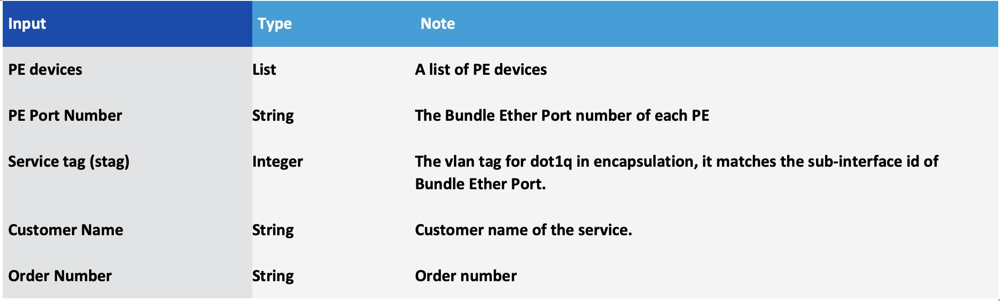
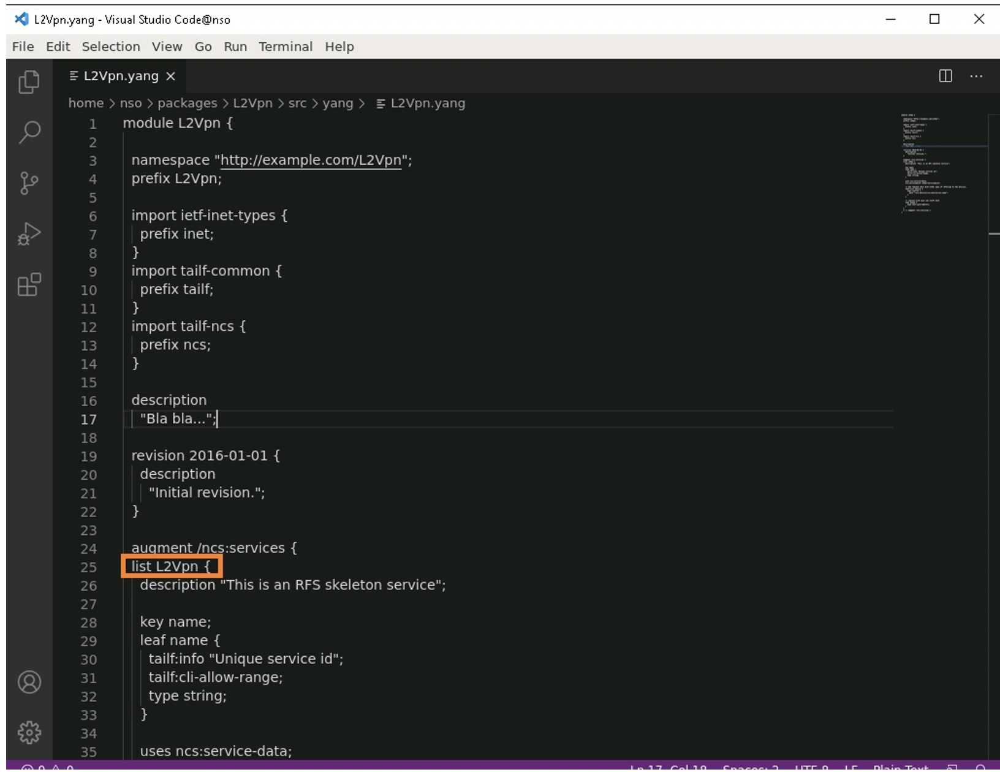
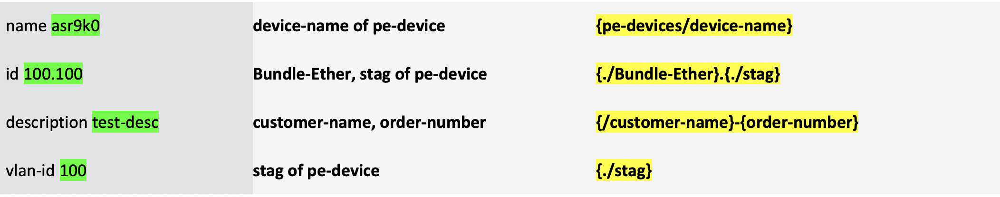
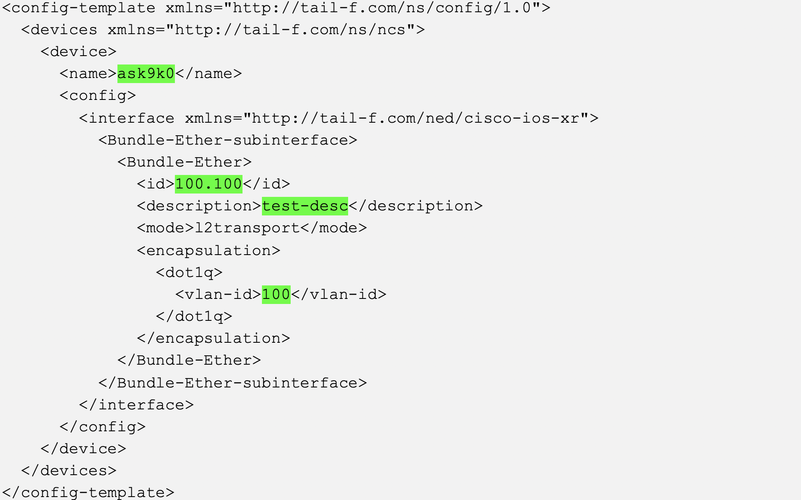

HOLOPS-1803
===========
**[Lab Introduction](https://github.com/weiganghuang/HOLOPS-1803/blob/master/HOLOPS-1803.md)**

**[Previos Scenario](https://github.com/weiganghuang/HOLOPS-1803/blob/master/task0.md)**

**[Next Scenario](https://github.com/weiganghuang/HOLOPS-1803/blob/master/task2.md)**

 Scenario 2.	Create L2VPN Service Package
----------------------------

In this scenario, the user will learn to create a service package for L2VPN. It starts with creating the service package skeleton, editing the service yang model based on the requirement, creating an xml template for service to device attributes mapping, deploying and validating the service package. This scenario shows all the steps of building an NSO package for service lifecycle management.

Requirements of the service package:

A service provider requires an orchestration tool to auto-configure L2VPN. The network is shown in the figure on the next page. The service provider decided to use NSO. We need to create a service package for the job. After finalizing the requirements, we can see that the table below lists the parameters of the service package and the command syntax text lists the CLI commands to be configured.

Our job is to create the service package. As shown below, the service gets a list of PEs. For each PE, it needs to create a Layer 2 transport Bundle-Ethernet sub-interface, where the PE Port number identifies the Bundle-Ethernet interface. The Service tag (stag) is the VLAN id to be encapsulated. The stag is also used as sub-interface id of the Bundle-Ethernet port. Customer name and order number must be configured as the description of the sub-interfaces.


Service Attributes:




CLI commands to be configured on PE for L2VPN service:

  ```
  interface Bundle-Ether <PE Port number>.<stag>l2transport 
  description "<customer name>-<order number>"
  encapsulation dot1q <stag>
  ```

In this scenario, you will create a service package skeleton and a service Yang model to capture the service attributes shown in the table above. You will then create service-to-device mapping to support the configuration of CLIs as shown above. Finally, you will deploy the service package onto your NSO host.
The service model is illustrated in the figure that follows. As shown in the diagram, L2Vpn is modelled as a list of ncs services. “sr-name” is the key of the list. Each L2Vpn contains leaf nodes of order-number and customer-name. In addition, it contains a list of pe-devices, each with a Bundle-Ether port and a stag (service tag).


The service YANG model:


### Create Service Skeleton 

1.  From the NSO vm  create a service skeleton package using
    `ncs-make-package` command, name it `L2Vpn`.
    
    ```
    [nso@nso]$ mkdir -p ~/packages
    [nso@nso]$ cd ~/packages
    [nso@nso packages]$ ncs-make-package --service-skeleton python-and-template --augment /ncs:services L2Vpn

    ```     

1.  The **ncs-make-package** in step 1 creates a directory structure (`L2Vpn`), and a skeleton of service files, which we will verify.

    ```
    [nso@nso packages]$ cd ~/packages/L2Vpn
    [nso@nso L2Vpn]$ ls
    package-meta-data.xml python README src templates test
    ```

1.  After completing step 2 above, enter the following two commands to view the skeleton files.  Make sure files `Makefile`, `L2Vpn.yang` and
    `L2Vpn-template.xml` are available:

    ```
    [nso@nso L2Vpn]$ tree src
	 src
    ├── Makefile
    └── yang
        └── L2Vpn.yang

    1 directory, 2 files
    [nso@nso L2Vpn]$ tree templates
    templates
    └── L2Vpn-template.xml
    
    0 directories, 1 file

    ```
4.	Enter the following command to return to the [nso@nso ~]$ prompt


    ```
    [nso@nso L2Vpn]$ cd	 
    [nso@nso]$ 

    ```

### Update the Auto-generated L2Vpn.yang

The skeleton of `L2Vpn.yang` file is auto-generated as part of
`ncs-make-package` command. In this procedure, you will update the
auto-generated Yang file, `L2Vpn.yang` to model the L2Vpn service. Use one of the following options to open and edit the file:

**Option 1: Edit `~/packages/L2Vpn/src/yang/L2Vpn.yang` from NSO server,
using an editor such as `vi`.**

**Option 2: At the `[nso@nso ~]$` prompt, enter `code ~/packages/L2Vpn/src/yang/L2Vpn.yang` This automatically launches the file in Visual Studio Code You can edit the file directly in Visual Studio Code.**


1.  The auto-generated `L2Vpn.yang` file contains several skeleton blocks. We will update the  L2Vpn block to add service attributes. To modify the generated Yang file, first locate the block that starts with `list L2Vpn`:

    

1.  Change “`name`” to “`sr-name`” for both key and leaf (at lines #28 and #29).

    ```
    augment /ncs:services {
        list L2Vpn {
            description "This is an RFS skeleton service";
            uses ncs:service-data;
            ncs:servicepoint L2Vpn-servicepoint;
            key sr-name;
            leaf sr-name {
                tailf:info "Unique service name";
                tailf:cli-allow-range;
                type string;
            }
    ```
    
4.	Delete of leaf-list device and leaf dummy blocks (delete all the lines from line #38 to the end).

1.  Add other service attributes: `order-number`, `customer-name`, after `sr-name` block (beginning at line #38.     
    ```
    
            leaf order-number {
                type string;
            }
            leaf customer-name {
                type string;
            }
            
    ```
  
1.  Add list attribute `pe-devices`
    with `device-name` as the key (beginning at line #41). Use the leaf reference  (`leafref`) points
    to NSO’s device model: (`/ncs:devices/ncs:device/ncs:name`). In addition, add leaf attributes `Bundle-Ether` and `stag`. 

    ```
            list pe-devices {
                key device-name;
                leaf device-name {
                    type leafref {
                        path "/ncs:devices/ncs:device/ncs:name";
                    }
                }
                leaf Bundle-Ether {
                    type string;
                }
                leaf stag {
                    type uint16 {
                        range 1..4095;
                    }
                }
            }
        }
      }
    }
    ``` 
    
1.  The content of the file is available at [L2Vpn.yang](https://github.com/weiganghuang/HOLOPS-1803/blob/master/solution/L2Vpn/src/yang/L2Vpn.yang)


	


1.  Save the updated L2Vpn.yang file.

9.	Enter the following commands to compile the project L2Vpn at the NSO server

    ```
    [nso@nso ncs-run]$ cd ~/packages/L2Vpn/src
    [nso@nso src]$ make clean all
    ```
    
    Sample output:
    
    ```
    [nso@nso src]$ make clean all
    rm -rf ../load-dir java/src//
    mkdir -p ../load-dir
    mkdir -p java/src//
    /home/nso/ncs-4.3.1/bin/ncsc \`ls L2Vpn-ann.yang >/dev/null 2>&1 && echo "-a L2Vpn-ann.yang"\` \\  
    -c -o ../load-dir/L2Vpn.fxs yang/L2Vpn.yang
    ```
    **Note: Make sure there is no compilation errors. For reference, you can find the solution yang file 
    `~/solution/L2Vpn/src/yang/L2Vpn.yang` of your nso server**.
    
    **Note: As an alternative, you can use the following to copy the yang file from solution, then repeat the previous step to compile**
    
	```
	[nso@nso src]$ cp ~/solution/L2Vpn/src/yang/L2Vpn.yang ~/packages/L2Vpn/src/yang/
	```

### Complete L2VPN Template to Map Service Model to Device Model Mapping

You have created the service model in the previous sections. Next, the L2Vpn service must send the proper CLIs to PE devices. In NSO terms, this is called service model to device model mapping.

In most cases, the service to device mapping can be easily implemented through an xml template. You will use this approach for L2Vpn. The skeleton of the mapping template xml file, L2Vpn-template.xml, is auto generated. In this procedure, you will add the contents.

We start with creating a sample Bundle Ether sub-interface (sub-interface 100.100, with vlan id 100) to a PE through the NSO CLI. NSO’s operation “commit dry-run” will have the NSO’s cisco-iosxr Ned calculate the device CLIs. The `commit dry-run outformat xml` command displays the output in xml format. This output is the starting point of the mapping template.


1.	At the NSO server, enter the following three commands to configure a Bundle Ether sub-interface 100.100 to the PE device asr9k0 via the NCS CLI. Make sure the third command `set devices....` is entered as one line.

    ```
    [nso@nso src]$ ncs_cli -u admin
    admin@ncs>conf
    admin@ncs% set devices device asr9k0 config cisco-ios-xr:interface Bundle-Ether-subinterface Bundle-Ether 100.100 mode l2transport description test-desc encapsulation dot1q vlan-id 100
    
    ```
	Sample output:

    ```
    [nso@nso src]$ ncs_cli -u admin
    admin connected from 198.18.133.252 using ssh on nso
    admin@ncs>conf
    Entering configuration mode private 
    [ok][2020-12-29 03:05:47]
    [edit]
    admin@ncs% set devices device asr9k0 config cisco-ios-xr:interface Bundle-Ether-subinterface Bundle-Ether 100.100 mode l2transport description test-desc encapsulation dot1q vlan-id 100
    [ok][2020-12-29 03:07:44]
    [edit] 
    admin@ncs%
    ```

2.	Now enter the `commit dry run outformat xml` command. This command will show the configuration changes to be sent to the device in .xml format.

    ```
    admin@ncs% commit dry-run outformat xml
    ```
    
    Expected output:
    
    ```
    result-xml {
      local-node {
        data <devices xmlns="http://tail-f.com/ns/ncs">
               <device>
                 <name>asr9k0</name>
                 <config>
                   <interface xmlns="http://tail-f.com/ned/cisco-ios-xr">
                     <Bundle-Ether-subinterface>
                       <Bundle-Ether>
                         <id>100.100</id>
                         <mode>l2transport</mode>
                         <description>test-desc</description>
                         <encapsulation>
                           <dot1q>
                             <vlan-id>100</vlan-id>
                           </dot1q>
                         </encapsulation>
                       </Bundle-Ether>
                     </Bundle-Ether-subinterface>
                   </interface>
                 </config>
               </device>
             </devices>
      }
    }
    [ok][2020-12-29 03:09:22]
    [edit]

    ```
    **IMPORTANT! Make sure to perform the following step describing how to exit from ncs config mode and the ncs CLI.**

1. We don’t want to commit the above changes to devices. Enter the following two commands to exit the NCS CLI without committing

    ```
    admin@ncs% exit no
    [ok][2020-06-02 01:47:29]
    admin@ncs> exit
    [nso@nso src]$
    ```
2. Enter the following command to return to the [nso@nso ~]$ prompt


    ```
    [nso@nso L2Vpn]$ cd	 
    [nso@nso]$ 

    ```
    
1.  Now let’s complete L2Vpn template file, L2Vpn-template.xml

    **Option 1: Edit ~/packages/L2Vpn/templates/L2Vpn-template.xml from
 NSO server, using `vi` for example;**

    **Option 2: At the [nso@nso ~]$ prompt, enter `code ~/packages/L2Vpn/templates/L2Vpn-template.xml` This automatically launches the file in Visual Studio Code You can edit the file directly in Visual Studio Code.**

1.  Edit file ~/packages/L2Vpn/templates/L2Vpn-template.xml. Replace
    the contents of the block of `<config-template
    xmlns="http://tail-f.com/ns/config/1.0">` with the output of `commit
    dry run outformat xml` command  at the previous step:

    ```
    <config-template xmlns="http://tail-f.com/ns/config/1.0">
      <devices xmlns="http://tail-f.com/ns/ncs">
               <device>
                 <name>asr9k0</name>
                 <config>
                   <interface xmlns="http://tail-f.com/ned/cisco-ios-xr">
                     <Bundle-Ether-subinterface>
                       <Bundle-Ether>
                         <id>100.100</id>
                         <mode>l2transport</mode>
                         <description>test-desc</description>
                         <encapsulation>
                           <dot1q>
                             <vlan-id>100</vlan-id>
                           </dot1q>
                         </encapsulation>
                       </Bundle-Ether>
                     </Bundle-Ether-subinterface>
                   </interface>
                 </config>
               </device>
             </devices>
      </config-template>
    ```

Next we will plant the service attributes to replace the sample parameters used to create the Bundle Ether sub-interface (sub-interface 100.100, with vlan id 100). The service attributes are identified as an xpath from service root L2vpn, with proper syntax (inside {}) and context, summarized in the table in the next section.

### NSO Ned (cisco-iosxr) to L2Vpn Attribute Mapping

NCS CLI Command:


Mapping:
    


1. Edit the template file opened in the previous section. In the block of `<config-template>`, replace the green highlighted values with the values highlighted in yellow in the above table. For example, replace `asr9k0` with `{pe-devices/device-name}`, replace `100.100` with `{./Bundle-Ether}.{./stag}`, replace `test-desc` with `{/customer-name}-{order-number}`, and replace `100` with `{./stag}`.

	

2. The final template file L2Vpn-template.xml should look like the following. Correct errors, if any, before you proceed.
 
    ```
    <config-template xmlns="http://tail-f.com/ns/config/1.0">
     <devices xmlns="http://tail-f.com/ns/ncs">
       <device>
         <name>{/pe-devices/device-name}</name>
         <config>
           <interface xmlns="http://tail-f.com/ned/cisco-ios-xr">
            <Bundle-Ether-subinterface>
              <Bundle-Ether>
                <id>{./Bundle-Ether}.{./stag}</id>
                <description>{/customer-name}-{/order-number}</description>
                <mode>l2transport</mode>
                <encapsulation>
                  <dot1q>
                    <vlan-id>{./stag}</vlan-id>
                  </dot1q>
                </encapsulation>
              </Bundle-Ether>
            </Bundle-Ether-subinterface>
          </interface>
        </config>
      </device>
    </devices>
    </config-template>
  
    ```
 
    **NOTE: For reference, you can find the solution template file 
    `~/solution/L2Vpn/templates/L2Vpn-template.xml` of your NSO server.**

1.  Save `L2Vpn-template.xml`.
	**As an alternative, you can use the following to copy the template file from solution**
    
	```
	[nso@nso]$ cp ~/solution/L2Vpn/templates/L2Vpn-template.xml ~/packages/L2Vpn/templates/
	```

### Deploy the Service Package L2Vpn

Now we are ready to deploy the service package to NSO application.

1.  On the NSO server, check current packages in your NSO installation, make sure make sure cisco-iosxr ned appear under
    `ncs-run/packages`:

    ```
    [nso@nso]$ ls –l ~/ncs-run/packages
    total 0
    lrwxrwxrwx. 1 nso nso 48 Nov 26 00:40 cisco-iosxr -> /home/nso/ncs-4.5.0.1/packages/neds/cisco-iosxr/

    ```

1.  Now we’ll make the package L2Vpn available for NSO. This involves creating a symbolic link to L2Vpn at the `packages` directory in the NSO runtime directory (`/home/nso/ncs-run/packages`). Enter the following three commands.

    **NOTE: Make sure you are creating the symbolic link at the `~/ncs-run/packages` directory.**

    ```
    [nso@nso]$ cd ~/ncs-run/packages
    [nso@nso packages]$ ln -s /home/nso/packages/L2Vpn/
    [nso@nso packages]$ ls -l
    total 0
    lrwxrwxrwx. 1 nso nso 48 Nov 26 00:40 cisco-iosxr -> /home/nso/ncs-4.5.0.1/packages/neds/cisco-iosxr/
    lrwxrwxrwx. 1 nso nso 25 Dec 11 23:08 L2Vpn -> /home/nso/packages/L2Vpn/


    ```
1. Enter the following command to return to the [nso@nso ~]$ prompt


    ```
    [nso@nso packages]$ cd	 
    [nso@nso]$ 

    ```

1.  On the NSO CLI, enter the following three commands to reload the packages to complete the package deployment process and then verify.

    **NOTE: Make sure the reload result is true. If you see errors, you can check the solution from `~/packages/solution`**

    ```
    [nso@nso ~]$ ncs_cli -u admin
    admin connected from 198.18.133.252 using ssh on nso
    admin@ncs> request packages reload 
    ```
    
    Sample output:
    
    ```
    >>> System upgrade is starting.
    >>> Sessions in configure mode must exit to operational mode.
    >>> No configuration changes can be performed until upgrade has completed.
    >>> System upgrade has completed successfully.
    reload-result {
    	package L2Vpn
    	result true
	 }
	 reload-result {
		package cisco-iosxr
		result true
    }
    [ok][2020-12-11 23:10:37]

	```
	
	```
	admin@ncs> show packages package package-version
	             PACKAGE
	NAME         VERSION
	----------------------
	L2Vpn        1.0
	cisco-iosxr  6.2.9

	[ok][2020-12-09 08:23:00]

    ```
    
1. Enter the following command to return to the [nso@nso ~]$ prompt


    ```
    admin@ncs> exit 
    [nso@nso]$ 

    ```

### Test the service package

In this section, you will test the service package L2Vpn. NSO running on the application server has 3 PE devices. You will create a test L2Vpn service instance.

1. 	Create an L2Vpn service instance, and name it `test`, set customer name as `duoabc`, and order-number `123`. In addition, set pe-devices as `asr9k0`, Bundle-Ether `100`, and stag `100`.

    ```
    [nso@nso]$ ncs_cli -u admin
    admin connected from 198.18.133.252 using ssh on nso
  	admin@ncs>conf
  	Entering configuration mode private
  	[ok][2020-12-29 08:20:16] 
  	[edit] 
  	admin@ncs% set services L2Vpn test customer-name duoabc order-number 123 pe-devices asr9k0 Bundle-Ether 100 stag 100
  	[ok][2020-12-29 08:21:00]
  	[edit]
	```

1.  Issuing the  `Commit dry run` shows the CLI’s to be configured to the asr9k0:

  	```
  	admin@ncs% commit dry-run outformat native 
  	```
  	
  	Sample output:
  	
  	```
  	native {
  		device {
  			name asr9k0
  			data interface Bundle-Ether 100.100 l2transport
  				description "duoabc-123"
  				encapsulation dot1q 100
  			exit
    	}
	}
	[ok][2020-12-29 08:21:08]
	[edit]
	admin@ncs%  
  	```
  	
1.  Commit the service instance test. After the commit, the service instance test is persistent in NSO’s memory database cdb, and the CLI commands from step 2 are committed to asr9k0.

  	```
  	admin@ncs% commit
	Commit complete.
	[ok][2020-12-29 08:21:18]
	[edit]
	admin@ncs% show services L2Vpn test
	order-number  123;
	customer-name duoabc;
	pe-devices asr9k0 {
    	Bundle-Ether 100;
    	stag         100;
	}
	[ok][2020-12-29 08:21:33]

	[edit]
	admin@ncs%
	
  	```
  	
1. Check the device configuration to verify that the intended CLI commands are configured at the  `asr9k0`:

	```	
	admin@ncs% show devices device asr9k0 config cisco-ios-xr:interface Bundle-Ether-subinterface Bundle-Ether 100.100
	```
	
	Expected output:
	
	```
    mode        l2transport;
    description duoabc-123;
    encapsulation {
       dot1q {
          vlan-id [ 100 ];
       }
    }
    [ok][2019-05-05 08:54:05]
    [edit]
    admin@ncs%
    ```

2. Delete the service instance `test` using the NSO CLI, then perform a `commit dry-run` operation.

     ```
     admin@ncs% delete services L2Vpn test
	 [ok][2020-12-29 08:42:24]
	 admin@ncs% commit dry-run outformat native
	 native {
    	device {
        name asr9k0
        data no interface Bundle-Ether 100.100 l2transport
    	}
	 }
	 [ok][2020-12-29 08:42:24]
	 [edit]
	 admin@ncs%
	 ```
6.	Commit your changes.

    ```
	 admin@ncs% commit
	 Commit complete.
	 [ok][2020-12-29 08:42:31]
	 [edit]
	 admin@ncs%
	 ```


1.  Check the device configuration to confirm that Bundle-Ether sub-interface `100.100` created through service instance `test` is removed.

	```
	admin@ncs% show devices device asr9k0 config cisco-ios-xr:interface Bundle-Ether-subinterface Bundle-Ether 100.100
	```
	
	Expected output:
	
	```
	-----------------------------------------------------------------------------------------------------------^
    syntax error: element does not exist
    [error][2019-05-05 08:56:55]

    [edit]
    admin@ncs%
  	 ```

1. Enter the following commands to return to the nso@nso prompt.

   ```
   admin@ncs% exit
   [ok][2019-06-06 13:37:30]
   admin@ncs> exit
   [nso@nso]$
   ```
   
In this scenario, you created, deployed, and tested an L2Vpn service package. Next, you will learn service discovery and reconcile when dealing with a brownfield network.

**This concludes scenario 2. Continue with the next scenario: Service Discovery and Reconciliation: Create L2Vpn Service Instances From Pre-existing Configuration**

**[Next Scenario](https://github.com/weiganghuang/HOLOPS-1803/blob/master/task2.md)**

**[Previos Scenario](https://github.com/weiganghuang/HOLOPS-1803/blob/master/task0.md)**

**[Lab Introduction](https://github.com/weiganghuang/HOLOPS-1803/blob/master/HOLOPS-1803.md)**


