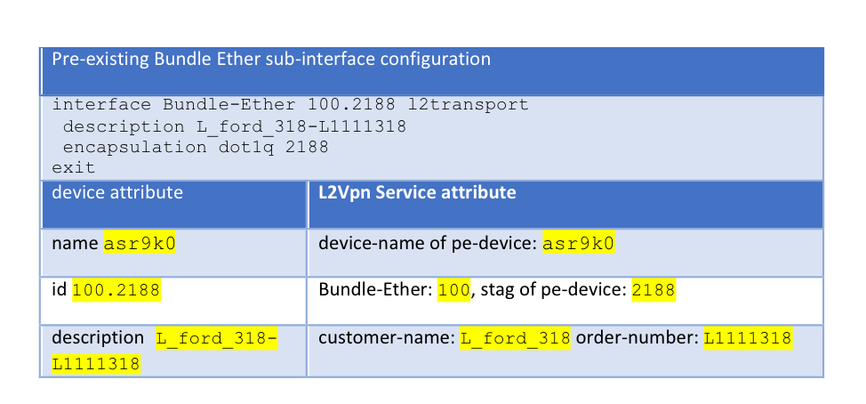

LABNMS-2500
===========

Task 2: Service discovery and reconciliation A: Create L2Vpn service instances from pre-existing configuration. 
--------------------------------------------------------------------------------------------------------

One of the typical brownfield service orchestration requirements is to
have NSO discover and reconcile the pre-existing services in the
network. The pre-existing service configurations can be brought into
NSO’s device model through NSO CLI operation “sync-from”. By default,
NSO assumes that devices own the pre-existing configuration. This is to
ensure that the out-of-band configurations are not accidentally
overwritten by NSO’s service operations.

However, in many cases, we need to have NSO fully manage the lifecycle
of the pre-existing services. This is called NSO service discovery and
reconciliation.

NSO service discovery and reconciliation for brownfield starts with
creating service instances (the service instances that match the
out-of-band service configurations. After the service instances are
created, we need to transfer the ownership of the configuration to NSO.

In this lab, the PE devices (asr9k0, asr9k1 and asr9k2) all have
pre-existing L2VPN services that are configured out-of-band. They are synced to NSO’s device model via NSO’s
`sync-from` operation.

Pre-existing L2VPN configuration on PE devices:


In this task, you will create L2Vpn service instances to match the
pre-existing configurations. You will also observe service lifecycle
management issues without transferring the ownership of the pre-existing
configuration.

### Check device model for pre-existing L2VPN configurations

As mentioned, the pre-existing L2VPN configurations are brought in to
NSO’s device model through `sync-from` operation.

1.  Perform a sync-from to bring the
    pre-existing configurations to NSO’s device model

	```
	[nso@cl-lab-211 ~]$ ncs_cli -u admin

	admin connected from 128.107.235.22 using ssh on cl-lab-211
	admin@ncs> conf
	admin@ncs% request devices sync-from
	sync-result {
    	device asr9k0
    	result true
	}
	sync-result {
    	device asr9k1
    	result true
	}
	sync-result {
    	device asr9k2
    	result true
	}
	[ok][2017-04-29 09:20:11]

	[edit]

	```
  
1.  Check NSO’s device model to view pre-existing Bundel-Ether
    sub-interfaces

	```
	[nso@cl-lab-211 ~]$ ncs_cli -u admin

	admin connected from 128.107.235.22 using ssh on cl-lab-211
	admin@ncs> conf
	admin@ncs% show devices device asr9k0 config cisco-ios-xr:interface Bundle-Ether-subinterface
	Bundle-Ether 100.2188 {
    	mode        l2transport;
    	description L_ford_318-L1111318;
    	encapsulation {
        	dot1q {
            vlan-id [ 2188 ];
        	}
    	}
	}
	Bundle-Ether 100.2234 {
    	mode        l2transport;
    	description L_unitedhealth_318-L1111318;
    	encapsulation {
        	dot1q {
            vlan-id [ 2234 ];
        	}
    	}
	}
	Bundle-Ether 100.2291 {
    	mode        l2transport;
    	description L_mckesson_318-L1111318;
    	encapsulation {
        	dot1q {
            vlan-id [ 2291 ];
        	}
    	}
	}
	………
	………

	```
  
### Create L2Vpn service instances for pre-existing configuration

As part of L2Vpn servivce discovery, 
one L2Vpn service instance should be created to match each pre-existing
Bundle-Ether sub-interface. In this step, you will manually create two
L2Vpn service instances to match two pre-existing Bundle-Ether
sub-interfaces, through NSO cli.

Compare to what we have done at *Task 1:*,
service instance creation is reverse mapping device model to service model. The following is the device attribute to service attribute mapping
example table:




1.  Create two service instances, name them as
    test1 and test2 to match two pre-existing configurations 
    **Note: Since you are creating L2Vpn service instances to match the
    pre-existing configurations, make sure the service attributes
    match exactly to what appear in device configuration.
    **

	 ```
	 [nso@cl-lab-211 ncs-run]$ ncs_cli -u admin

	admin connected from 128.107.235.22 using ssh on cl-lab-211
	admin@ncs> conf
	Entering configuration mode private
	Current configuration users:
	admin ssh (cli from 128.107.235.22) on since 	2017-04-29 09:17:58 private mode
	[ok][2017-04-29 09:35:29]

	[edit]
	admin@ncs% set services L2Vpn test1 order-number L1111318 customer-name L_ford_318 pe-devices asr9k0 Bundle-Ether 100 stag 2188
	[ok][2017-04-29 09:36:33]

	[edit]
	admin@ncs% set services L2Vpn test2 order-number L1111318 customer-name L_unitedhealth_318 pe-devices asr9k0 Bundle-Ether 100 stag 2234
	[ok][2017-04-29 09:39:25]

	[edit]

	 ```
  
1. Confirm “commit dry-run” output is empty.
	

   **Make sure you are still in ncs cli’s config mode**, **if “commit
    dry-run” output is not empty, do not continue. Check the attribute
    values at the previous step.**

	```
	admin@ncs% commit dry-run outformat native                                                            
	native {
	}
	[ok][2017-04-29 09:39:30]

	```
1.  After confirm the output of `commit dry-run outformat native` does
    not contain any CLI, continue commit the service instances, and then
    exit from ncs cli. We will commit with option `no-networking`, this
    option makes sure the instances are committed to cdb without
    changing the configuration of network devices.

    **Make sure you are still in ncs cli’s config mode**. With option
    `no-networking`, NSO is committing the changes only to cdb.

	```
	admin@ncs% commit no-networking
	Commit complete.
	[ok][2017-04-29 09:42:50]

	[edit]
	admin@ncs% exit
	[ok][2017-06-02 07:58:37]
	admin@ncs> exit
	[nso@cl-lab-211 packages]$

	 ```
  
### Observe the issues 

As mentioned, although the service instances (`test1` and `test2`) matching the
two pre-existing Bundle-Ether sub-interfaces are committed in NSO, NSO
is not able to modify or delete the associated device configuration.
This is because, by default, devices own the out-of-band configurations.

1. Try to delete instance `test1`.

	```
	[nso@cl-lab-211 packages]$ ncs_cli -u admin

	admin connected from 172.23.123.13 using ssh on cl-lab-211
	admin@ncs> conf
	Entering configuration mode private
	[ok][2017-06-02 07:59:37]

	[edit]

	admin@ncs% show services L2Vpn test1
	order-number  L1111318;
	customer-name L_ford_318;
	pe-devices asr9k0 {
    Bundle-Ether 100;
    stag         2188;
	}
	[ok][2017-04-29 10:04:30]

	[edit]
	admin@ncs% delete services L2Vpn test1
	[ok][2017-04-29 10:04:40]

	[edit]
	admin@ncs% commit dry-run outformat native
	native {
	}
	[ok][2017-04-29 10:04:47]

	[edit]
	admin@ncs% commit
	Commit complete.
	[ok][2017-04-29 10:04:56]

	[edit]

	``` 

1.  After commit the delete operation, confirm service instance `test1` is
    no longer in cdb of NSO.

  	```
  	admin@ncs% show services L2Vpn test1
	-------------------------------^
	syntax error: element does not exist
	[error][2017-05-05 00:44:15]
	[edit]
	admin@ncs%   	
	```

1.  Although the service instance test1is deleted from NSO, the
    associated Bundle Ether sub-interface 100.2188 **remains** in
    asr9k0. The out-of-band configuration can’t be modified through NSO!
    
	```
	admin@ncs% show devices device asr9k0 config cisco-ios-xr:interface Bundle-Ether-subinterface Bundle-Ether 100.2188
	Bundle-Ether 100.2188 {
    	mode        l2transport;
    	description L_ford_318-L1111318;
    	encapsulation {
    		dot1q {
				vlan-id [ 2188 ];
          }
      }
	}

	```

You have completed Task 2. You created two L2Vpn service instances to
match the pre-existing configurations. You also observed that deleting
or modifying the service instances does not change the out-of-band
device configuration. This implies that NSO is not managing the
lifecycle of service instances of pre-existing configuration.

In next Task, you will learn to complete service reconciliation by
resetting the reference count of pre-existing services:

[Task3 Service discovery and reconciliation B: Reset reference count](https://github.com/weiganghuang/labnms-2500/blob/master/task3.md)
-----------------------------

 