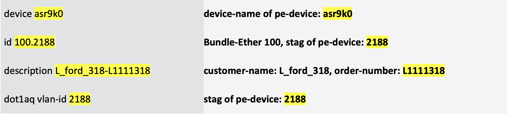

HOLOPS-1803
===========

Scenario 3.	Service Discovery and Reconciliation: Create L2Vpn Service Instances from Pre-existing Configuration 
--------------------------------------------------------------------------------------------------------

One of the typical brownfield service orchestration requirements is to have NSO discover and reconcile the pre-existing services in the network. The pre-existing service configurations can be brought into NSO’s device model through NSO CLI operation “sync-from”. By default, NSO assumes that devices own the pre-existing configuration. This is to ensure that the out-of-band configurations are not accidentally overwritten by NSO’s service operations. 

However, in many cases, we need to have NSO fully manage the lifecycle of the pre-existing services. This is called NSO service discovery and reconciliation.

NSO service discovery and reconciliation for brownfield starts with creating service instances (the service instances that match the out-of-band service configurations. After the service instances are created, we need to transfer the ownership of the configuration to NSO. 

In this scenario, you will create L2Vpn service instances to match the pre-existing configurations. You will also observe service lifecycle management issues without transferring the ownership of the pre-existing configuration.

In this lab, the PE devices (asr9k0, asr9k1 and asr9k2) all have pre-existing L2VPN services that are configured out-of-band. The configuration commands below lists part of them. They are synced to NSO’s device model via NSO’s `sync-from` operation.

### Pre-existing L2VPN configuration on PE devices:


### Check device model for pre-existing L2VPN configurations

As previously mentioned, the pre-existing L2VPN configurations are brought in to NSO’s device model through a `sync-from` operation.

1. Enter the following commands to make sure we have a working L2VPN package (from Scenario 1) in the setup. The operation takes about one minute to complete.

    ```
	[nso@nso ~]$ cd ansible
	[nso@nso ansible]$ ansible-playbook ~/ansible/set-task1.yml
	 ```
	
2.	Enter the following command to return to the nso@nso prompt.  

    ```
	[nso@nso ansible]$ cd
	[nso@nso ~]$
	```
	

1. Perform a sync-from to bring the
    pre-existing configurations to NSO’s device model.

	```
	[nso@nso ~]$ ncs_cli -u admin

	admin connected from 128.107.235.22 using ssh on nso
	admin@ncs> conf
	admin@ncs% request devices sync-from
	```
	
	Sample output:
	
	```
	sync-result {
    	device asr9k0
    	result true
	}
	sync-result {
    	device asr9k1
    	result true
	}
	sync-result {
    	device asr9k2
    	result true
	}
	[ok][2020-12-29 09:20:11]

	[edit]

	```
4.	Enter the following commands to return to the nso@nso prompt.
    
    ```
    admin@ncs% exit
    [ok][2021-01-22 14:26:29]
    admin@ncs> exit
    [nso@nso ~]$
    ```

      
1.  Check NSO’s device model to view pre-existing Bundel-Ether
    sub-interfaces.

	```
	nso@nso ~]$ ncs_cli -u admin
	admin connected from 198.18.133.252 using ssh on nso
	admin@ncs> conf
	admin@ncs% show devices device asr9k0 config cisco-ios-xr:interface Bundle-Ether-subinterface
	```
	
	Sample output:
	
	```
	Bundle-Ether 100.2188 {
    	mode        l2transport;
    	description L_ford_318-L1111318;
    	encapsulation {
        	dot1q {
            vlan-id [ 2188 ];
        	}
    	}
	}
	Bundle-Ether 100.2234 {
    	mode        l2transport;
    	description L_unitedhealth_318-L1111318;
    	encapsulation {
        	dot1q {
            vlan-id [ 2234 ];
        	}
    	}
	}
	Bundle-Ether 100.2291 {
    	mode        l2transport;
    	description L_mckesson_318-L1111318;
    	encapsulation {
        	dot1q {
            vlan-id [ 2291 ];
        	}
    	}
	}
	………
	………

	```
  
### Create L2Vpn service instances for pre-existing configuration

As shown on the first page of this scenario, one L2Vpn service instance should be created to match each pre-existing Bundle-Ether sub-interface. In this procedure, you will manually create two L2Vpn service instances to match two pre-existing Bundle-Ether sub-interfaces, through the NSO CLI.

Recall what we have done in Scenario 2 (Create L2VPN Service Package), this is reverse mapping of device model to service model. Similar to a previous information table, let’s build a device attribute to service attribute mapping example.

Pre-existing Bundle-Ether Sub Interface Configuration:


The device attribute to service attribute mapping:




1.  Create two service instances, name them test1 and test2 to match two pre-existing configurations (refer above mapping table). 
    
    **NOTE: Since you are creating L2Vpn service instances to match the pre-existing configurations, make sure the service attributes match exactly to what appear in the device configuration.**

    Enter config mode:
	 ```
	 [nso@nso ncs-run]$ ncs_cli -u admin

	admin connected from 128.107.235.22 using ssh on nso
	admin@ncs> conf
	Entering configuration mode private
	Current configuration users:
	admin ssh (cli from 128.107.235.22) on since 	2020-12-29 09:17:58 private mode
	[ok][2020-12-29 09:35:29]

	[edit]
	 ```
	 Create service instances:
	 ```
	admin@ncs% set services L2Vpn test1 order-number L1111318 customer-name L_ford_318 pe-devices asr9k0 Bundle-Ether 100 stag 2188
	[ok][2020-12-29 09:36:33]

	[edit]
	admin@ncs% set services L2Vpn test2 order-number L1111318 customer-name L_unitedhealth_318 pe-devices asr9k0 Bundle-Ether 100 stag 2234
	[ok][2020-12-29 09:39:25]

	[edit]

	 ```
  
1. Confirm that the output of `commit dry-run` is  **empty**.
	

   **NOTE: Make sure you are still in NCS CLI config mode. If the output of `commit dry-run` is not empty, do not continue. Re-check the attribute values entered in step 1..**

	```
	admin@ncs% commit dry-run outformat native  
	```
	
	Expecte **empty** in `native` block:
	
	```                                                          
	native {
	}
	[ok][2020-12-29 09:39:30]

	```
	
3.	After confirming that the output of `commit dry-run outformat native` is empty, continue to commit the service instances, and then exit from NCS CLI. We will commit with the option `no-networking`; this option makes sure the instances are committed to cdb without changing the configuration of network devices.

    **NOTE: Make sure you are still in NCS CLI config mode. With the option `no-networking`, NSO is committing the changes only to CDB**

	```
	admin@ncs% commit no-networking
	Commit complete.
	[ok][2020-12-29 09:42:50]

	[edit]
4.	Enter the following commands to exit from ncs cli.

   ```
   admin@ncs% exit
   [ok][2020-06-02 07:58:37]
   admin@ncs> exit
   [nso@nso packages]$
	```
  
### Observe the issues 

As mentioned, although the service instances (`test1` and `test2`) matching the
two pre-existing Bundle-Ether sub-interfaces are committed in NSO, NSO
is not able to modify or delete the associated device configuration.
This is because, the pre-existing L2Vpn are configured out-of-band, NSO is not managing those by default.

1. Try to delete instance `test1`.

	```
	[nso@nso packages]$ ncs_cli -u admin

	admin connected from 198.18.133.252 using ssh on nso
	admin@ncs> conf
	Entering configuration mode private
	[ok][2020-06-02 07:59:37]

	[edit]
	```
	
	Before delete, we can see `test1` in NSO:
	
	```
	admin@ncs% show services L2Vpn test1
	```
	
	Sample output:
	
	```
	order-number  L1111318;
	customer-name L_ford_318;
	pe-devices asr9k0 {
    Bundle-Ether 100;
    stag         2188;
	}
	[ok][2020-12-29 10:04:30]

	[edit]
	```
	Now delete `test1`
	
	```
	admin@ncs% delete services L2Vpn test1
	[ok][2020-12-29 10:04:40]

	[edit]
	admin@ncs% commit dry-run outformat native
	native {
	}
	[ok][2020-12-29 10:04:47]

	[edit]
	admin@ncs% commit
	Commit complete.
	[ok][2020-12-29 10:04:56]

	[edit]

	``` 

1.  After commit the delete operation, confirm service instance `test1` is
    no longer in cdb of NSO.

  	```
  	admin@ncs% show services L2Vpn test1
	-------------------------------^
	syntax error: element does not exist
	[error][2020-12-05 00:44:15]
	[edit]
	admin@ncs%   	
	```

1.  Although the service instance `test1` is deleted from NSO, the
    associated Bundle Ether sub-interface 100.2188 **remains** in
    asr9k0. The out-of-band configuration can’t be modified through NSO!
    
	```
	admin@ncs% show devices device asr9k0 config cisco-ios-xr:interface Bundle-Ether-subinterface Bundle-Ether 100.2188
	```
	
	Sample outout:
	
	```
	Bundle-Ether 100.2188 {
    	mode        l2transport;
    	description L_ford_318-L1111318;
    	encapsulation {
    		dot1q {
				vlan-id [ 2188 ];
          }
      }
	}

	```

You have completed Task 2. You created two L2Vpn service instances to
match the pre-existing configurations. You also observed that deleting
or modifying the service instances does not change the out-of-band
device configuration. This implies that NSO is not managing the
lifecycle of service instances of pre-existing configuration.

In next Task, you will learn to complete service reconciliation by
resetting the reference count of pre-existing services:

[Task3 Service discovery and reconciliation B: Reset reference count](https://github.com/weiganghuang/HOLOPS-1803/blob/master/task3.md)
-----------------------------

 