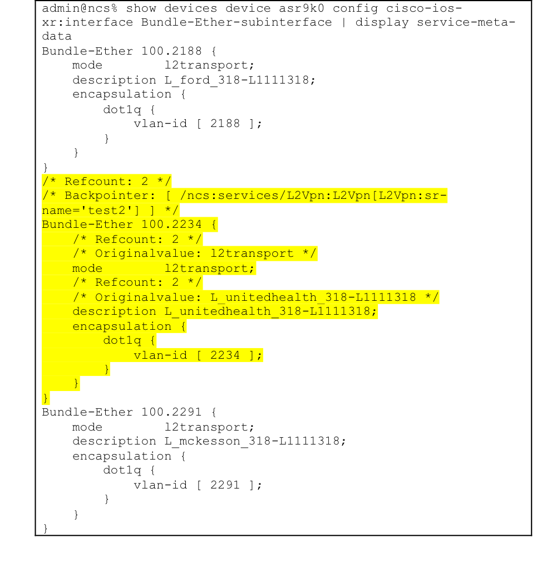
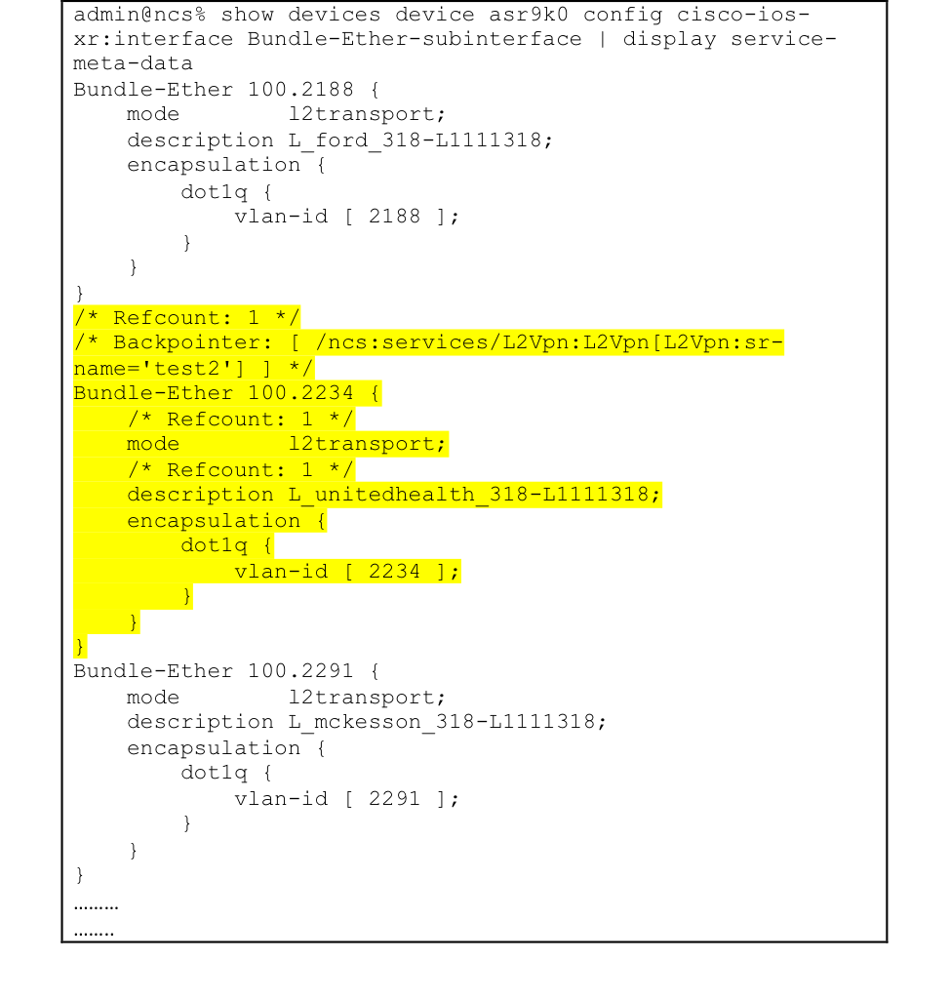

LABNMS-2500
===========

Task 3: Service discovery and reconciliation B: Reset reference count
-------------------------------------------------------------

As the first step of service discovery, the L2Vpn service instances are
created in the previous Task. To complete the discovery process, we need
to reconcile the pre-existing L2VPN services.

NSO uses an annotation tag of reference count to keep track of the
configuration ownership. In this task, you will learn how to transfer
the ownership of pre-existing configuration from device’s out-of-band to
NSO by ref-count reset operation. Once the ref-count is reset, NSO can
manage the lifecycle of the pre-existing L2VPN services. You will test
by deleting the service instances and see the associated
Bundle-Ether-sub interfaces are removed from the devices.

In this task, you will work on instance `test2` to complete the service
discovery/reconcile through resetting the reference count (ref-count).

### Check the ref-count of L2VPN configuration

1.  Check ref-count of the Bundle Ether sub-interfaces. As you can see,
    Bundle-Ether 100.2234 has backpointers point to the service instance
    test2 we created at the *Task 2*. The value of ref-count
    is 2. This indicates that NSO service instance test2 is not the sole
    owner of the configuration.

	```
	admin@ncs% show devices device asr9k0 config cisco-ios-xr:interface Bundle-Ether-subinterface | display service-meta-data
	```
	Sample output displays the reference count and backpointer:
	
	
	
### Reset the ref-count of L2VPN configuration

At this step, you will transfer the configuration ownership from device
to NSO through ref-count reset.

1.  Reset ref-count of Bundel-Ether 100.2234 through the cli operation
    `service L2Vpn re-deploy reconcile`. This resets the ref-count, NSO service instance `test2` will then be the sole owner of the
    configurations.

	```
	admin@ncs% request services L2Vpn test2 re-deploy reconcile
	[ok][2017-11-26 11:42:19]
  	[edit]
	```
  

1. Perform a device sync-from.
	```
	admin@ncs% request devices sync-from
	sync-result {
    	device asr9k0
    	result true
	}
	sync-result {
    	device asr9k1
    	result true
	}
	sync-result {
    	device asr9k2
    	result true
	}
	[ok][2017-04-29 09:20:11]

	[edit]

	```

1.  Now let’s check ref-count. 
	
	```
	admin@ncs% show devices device asr9k0 config cisco-ios-xr:interface Bundle-Ether-subinterface | display service-meta-data
	```
	Sample output displays the reference count and backpointer of `test2` after reconciliation. Note the value of ref-count attached
    with `Bundle-Ether 100.2234` is 1, backpointer to `test2`:
	
	
  

### Try to delete the service instance created (`test2`)

After re-setting the ref-count, the pre-existing L2VPN is reconciled,
NSO is managing the lifecycle of the reconciled service instance. In
this step, you will see the correct behaviour when we delete `test2`

1.  Delete `test2`, notice the output of `commit dry-run outformat native`
    contains the correct `no` statement to remove the Bundle Ether
    sub-interface 100.2234.
    
    ```
    admin@ncs% show services L2Vpn test2
    order-number  L1111318;
    customer-name L_unitedhealth_318;
    pe-devices asr9k0 {
       Bundle-Ether 100;
       stag         2234;
    }
    [ok][2017-04-29 10:04:30]
    
    [edit]
    admin@ncs% delete services L2Vpn test2
    [ok][2017-04-29 11:34:32]
    [edit]
    admin@ncs% commit dry-run outformat native
    native {
      device {
        name asr9k0
        data no interface Bundle-Ether 100.2234 l2transport
      }
    }
    [ok][2017-04-29 11:34:39]
    
    [edit]
    ```

1. Commit after confirm the dry-run output
   
   ```
   admin@ncs% commit
   Commit complete.
   [ok][2017-04-29 11:34:47]
  
   [edit] 
   ```

1. Now check device model to see Bundle-Ether 100.2234 no longer exists in asr9k0.
   
   ```
   admin@ncs% show devices device asr9k0 config cisco-ios-xr:interface Bundle-Ether-subinterface Bundle-Ether 100.2234
   ----------------------------------------------------- ------------------------------------------------------\^
   syntax error: element does not exist
   [error]$[2017-04-29 11:40:54]
  
   [edit]
   ```

Congratulations! You have successfully finished all the tasks of this
lab!

From Task 1, you learned how to generate NSO service packages. You
created a service package L2Vpn with service Yang model, and template
xml to generate device configlet.

From Task 2 and Task 3, you learnt how to perform service discovery with
brownfield network. You created L2Vpn instances from pre-existing device
configurations, observed the issues, reset the reference count to fully
manage the lifecycle of L2Vpn service instances.

The next task is to extend the service discovery process from manual to
automatic. It is recommended to go through the task and learn how to
create massive service instances from pre-existing configurations, and
reset ref-count automatically:

[Task4 (Extra Credit): Create an NSO action to discover pre-existing L2VPN service instances automatically](https://github.com/weiganghuang/labnms-2500/blob/master/task4.md)
------------------------------
