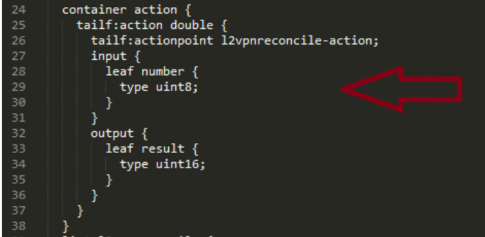
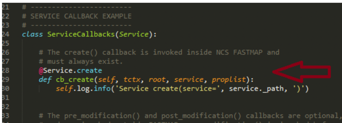
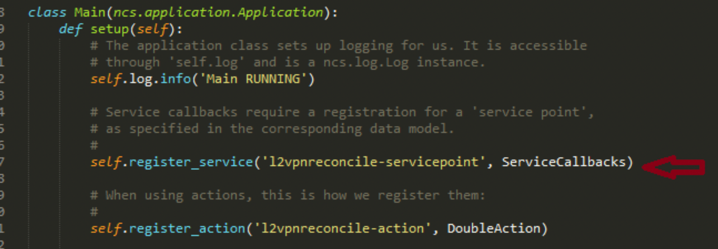
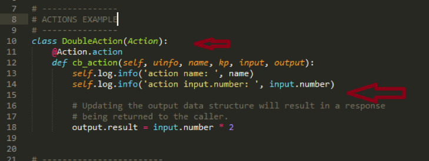
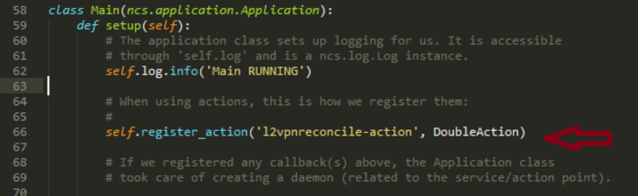
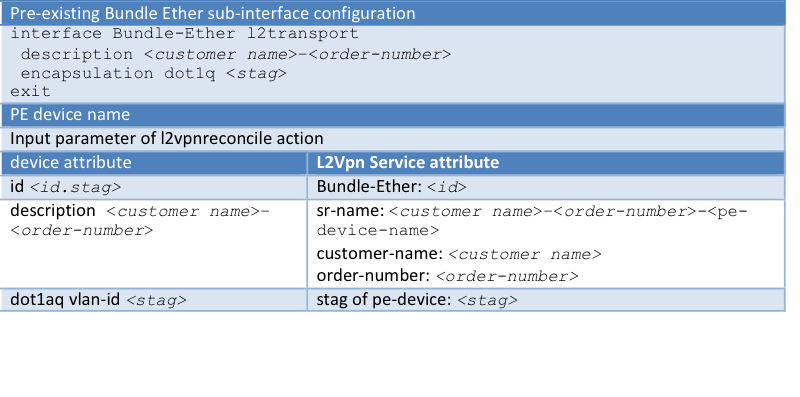

LABNMS-2500
===========


Task 4(Extra Credit): Create an NSO action to discover pre-existing L2VPN service instances automatically. 
----------------------------------------------------------------------------------------------------

In the previous two tasks, Task 2 and Task3, you learned to discover
pre-existing service configurations manually. As one can see, manually
creating service instances to match all the attributes in pre-existing
configurations is time consuming, tedious, and error prone. This
approach does not scale for networks with fair amount of pre-existing
services. To be able to support brownfield network service lifecycle
management, we need to discover pre-existing services automatically.

There are several ways to auto-discover services. One of them is
creating service instances from device model using NSO’s maapi and magic
API’s, followed by resetting the ref-count for the service instances
programmatically.

In this task, you will learn how to create an NSO action to discover
pre-existing L2VPN services through an NSO action.

   **Note: This task requires python programming, and knowledge of NSO
    maagic and maapi API’s**.

### Create package skeleton for reconcile action

In NSO, action callbacks are used to implement arbitrary operations in
java or python. These operations can be basically anything, e.g.
downloading a file, performing some test, resetting alarms, etc. We will
create an action package, `l2vpnreconcile`, to perform L2Vpn service
discovery. Although it can be easily extended, for simplicity, this lab
designs the action to perform service discovery from one PE device.

Similar to what we did at Task 1, you will create the package skeleton
first.

1. From NSO VM, create a skeleton package,
    name it `l2vpnreconcile`
    
   ```
   [nso@cl-lab-211]$ cd ~/packages
   [nso@cl-lab-211 packages]$ ncs-make-package --service-skeleton python --action-example l2vpnreconcile
   [nso@cl-lab-211 packages]$ cd l2vpnreconcile
   [nso@cl-lab-211 l2vpnreconcile]$ ls
   package-meta-data.xml python README src templates test
   
   ```
### Update l2vpnreconcile.yang file

Action l2vpnreconcile has one input parameter, the PE that we wish to
reconcile the L2Vpn service from. The action has two output parameters,
success (boolean) and message (string), for discovery result, and a
message associated with. You will modify the auto-generated yang file to
capture the input and output parameters.

**Option 1: Edit `~/packages/l2vpnreconcile/src/yang/l2vpnreconcile.yang` from NSO server,
using `vi` for example;**

**Option 2: Copy file `~/packages/l2vpnreconcile/src/yang/l2vpnreconcile.yang` from NSO
server to jump server using `WinScp`
(****). Edit the file using editors such as
Sublime (** **), or
Notepad++(****). If you take Option 2, remember copy
the file back to NSO server.**

1.  Edit l2vpnreconcile.yang . We put the action reconcile-l2vpn under
    container action:



1.  Change the generated generic action name “double” to
    `reconcile-l2vpn`, and action point `l2vpnreconcile-action` to
    “reconcile”. In addition, as specified above, replace the default
    input parameter `number` with `device-name`, and the default output
    parameter `result1 with `success` and `message`.

    The contents of l2vpnreconcile.yang should look like the following, available at [l2vpnreconcile.yang](https://github.com/weiganghuang/labnms-2500/blob/master/solution/l2vpnreconcile/src/yang/l2vpnreconcile.yang)
    
    ```
    module l2vpnreconcile {

      namespace "http://example.com/l2vpnreconcile";
      prefix l2vpnreconcile;

      import ietf-inet-types { prefix inet; }
      import tailf-common { prefix tailf; }
      import tailf-ncs { prefix ncs; }

      description
        "Bla bla...";

      revision 2016-01-01 {
        description
          "Initial revision.";
      }

      container action {
        tailf:action reconcile-l2vpn {
        tailf:actionpoint reconcile;
        input {
          leaf device-name {
            type leafref {
              path "/ncs:devices/ncs:device/ncs:name" ;
            }
        }
       }
       output {
         leaf message {
           type string;
         }
         leaf success {
           type boolean;
         }
        }
       }
      }
    }

    ```
    **Note: Check
    ~/solution/l2vpnreconcile/src/yang/l2vpnreconcile.yang for
    reference.**

1.  Save l2vpnreconcile.yang. If you edit the file from the windows jump
    start server, make sure you copy the file back to NSO server, to
    `/home/nso/packages/l2vpnreconcile/src/yang/`

### Clean up generated python script

The package l2vpnreconcile is auto generated as a service skeleton. Auto-generated python file `main.py` contains snips of
service call back class, which we don’t need. In addition, we want to
rename the generic default action class `DoubleAction` to `Reconcile`.

1.  Edit python file,
    `/home/nso/packages/l2vpnreconcile/python/l2vpnreconcile/main.py`.
    Remove service related python script. Delete the  `Service Call Back Example` class (make sure
    the whole class `ServiceCallbacks` is deleted)

    
   

1.  Remove service registration from `Main` class, delete this line `self.register_service('l2vpnreconcile-servicepoint', ServiceCallbacks)`:

    

  
1.  Rename the auto generated action class name from
    `DoubleAction(Action)` to `Reconcile(Action)`. Remove the contents of
    `cb_action` (We will replace the contents later):

    
    
    The class `Reconcile` should look like:
    
    ```
    class Reconcile(Action):
    	@Action.action
    	def cb_action(self, uinfo, name, kp, input, output):

    ```
  

1.  in Main function, change the action registration accordingly, 
    replace `DoubleAction` with `Reconcile`.

	 
	 
	 As following:
	 
	 ```
	 class Main(ncs.application.Application):
    	def setup(self):

        # When using actions, this is how we register them:
        #
        self.register_action('l2vpnreconcile-action', Reconcile)

	 ```
     
2.   The cleaned `main.py` is available at [main-clean.py](https://github.com/weiganghuang/labnms-2500/blob/master/solution/l2vpnreconcile/python/l2vpnreconcile/main-clean.py)

### Implement the action call back function to reconcile pre-exisiting L2VPN service.

In this step, you will add python code to action call back function
`cb_action`. Inside `cb_action`, you will create L2Vpn service instances
from device model, and reset reference count of the service instances.

Creating service instances from device model is a reverse process as
compare to creating a service package. You now need to map device NED
attributes to service attributes. 

After a `sync-from` operation, the pre-existing configurations are brought
into NSO’s device model. To create L2Vpn service instances, we need to
open a write transaction of cdb, walk through device model, populate
service instance attributes and commit the service instances to cdb.

The logic flow is illustrated as pseudo code in the following. We
will take several steps to go through the implementation.

Flow of reconcile L2Vpn services

  ```
  1.  Start write transaction of cdb 
  2.  From cdb device model, get all Bundle-Ether-subinterfaces of the pe-device (passed in as input parameter of the action)
  3.  For each Bundle-Ether-subinterface:
      a.  Get the Bundle-Ether-subinterface id (formate as x.y, where x is Bundle-Ether port y represents the sub-interface id)
      b.  Parse the Bundle-Ether-subinterface id to get Bundle-Ether port number (x) and Bundle-Ether sub-interface id (y)
      c.  Get description, this will be used for L2Vpn service instance name. 
      d.  Parse description to get customer name and order number
      e.  Get encapsulation dot1q vlan id
      f.  Create a L2Vpn service instance with:
          i.  sr-name: description-pe-device
          ii. pe-devices: the pe-device
          iii. pe-device port number: x
          iv. pe-device port stag: y
          v.  customer: customer name
          vi. order-number: order number 
  4.  Commit dry-run (expect empty output)
  5.  Commit the transaction with no-network (not touching devices) 
  6.  Reset reference count of the service instances (service re-deploy reconcile)
  
  ```

Continue editing file `main.py`.

1. Import additional packages, `random` and `_ncs` (on top of `main.py`)

   ```
   import ncs
   from ncs.application import Service
   from ncs.dp import Action
   import random
   import _ncs
   ```

1. We will create L2Vpn service instances in NSO cdb. Inside `cb_action`, open write transaction after initialize local variables `pe_device` and `srs`:
   
   ```
   @Action.action
     def cb_action(self, uinfo, name, kp, input, output):
    
      pe_device = ''
      srs = []
      with ncs.maapi.Maapi() as m:
        with ncs.maapi.Session(m, uinfo.username, uinfo.context):
          with m.start_write_trans() as t:

   ```

1.  Within the transaction block, continue walk through device model.
    Use NSO's maagic api to get the list of Bundle Ether sub-interfaces of the
    pe-device, via the xpath
    `ncs:devices/ncs:device{device-name}/config/cisco-ios-xr:interface/Bundle-Ether-subinterface/Bundle-Ether`
    
    **Note: Helper fundtion `getDevice` is defined later. **

    We add check (the if len(bundleEths) == 0: block) to cover the case when the device has no Bundle Ether sub-interfaces, in which, there is no need to create any service instances, the block will return with message of reconciliation finished.
    
    ```
    @Action.action
     def cb_action(self, uinfo, name, kp, input, output):
    
      pe_device = ''
      srs = []
      with ncs.maapi.Maapi() as m:
        with ncs.maapi.Session(m, uinfo.username, uinfo.context):
          with m.start_write_trans() as t:
            try:                  
              root = ncs.maagic.get_root(t) 
              pe_device = self.getDevice(input.device_name, root);
              int_path = '/ncs:devices/ncs:device{%s}/config/cisco-ios-xr:interface/Bundle-Ether-subinterface/Bundle-Ether' %input["device-name"]        
              if t.exists(int_path):
              
                bundleEths = ncs.maagic.get_node(t,int_path)  
                if len(bundleEths) == 0:
                  output.success = True
                  output.message = "finish reconcile"  
                  return    
     ```

1.  For each Bundle Ether sub-interface in device config, create one
    L2Vpn service instance. Similar to manual service instance creation
    we use device attributes to
    populate service instance attributes. Use interface description plus pe device name as
    sr-name for L2Vpn service instance, and set attributes order-number
    and customer-name. 
    
    NSO Device (cisco-iosxr) to L2Vpn
attribute mapping example for auto service instance creation

    

    A couple of checks added to cover cases when the Bundle Ether sub-interface does not have stag (vlan_id) populated, or when the description is not populated properly.

    ```
    ....
             for bundleEther in bundleEths:
                id , bstag = bundleEther.id.split('.')
                description = bundleEther.description
                stags = bundleEther.encapsulation.dot1q.vlan_id              
                if stags is  None or len(stags)==0:
                  continue 
                stag = 0
                for stag in stags: 
                  if int(stag) == int(bstag):                 
                    break
                if stag == 0:
                  self.log.warning('vlan tag not configured, or does not match sub-interface id for Bundle-Ether-subinterface %s, use sub-interface id'%bundleEther.id)

                order_number = ''
                customer = ''
                if description is None:
                  order_number = self.getRs()
                  customer = 'ciscolive'
                  sr_name = 'reconcile-'+ customer + '-'+order_number
                else:
                  sr_name = description + '-'  + input.device_name
                  customer,order_number = description.split('-')
                sr_path = 'ncs:services/L2Vpn:L2Vpn{%s}' %(sr_name)
                if t.exists(sr_path):
                    self.log.info('sr ' + sr_name + 'exists, skipping')
                    continue
                sr_node = ncs.maagic.get_node(t, "/ncs:services/L2Vpn:L2Vpn")
                obj = sr_node.create(sr_name)
                obj.sr_name = sr_name
                obj.order_number = order_number
                obj.customer_name = customer

    ```
  
1. Continue to create PE node for the service instance, set attributes
    of Bundle Ether port number (`id`) and `stag`.

   ```
                stag = bundleEther.encapsulation.dot1q.vlan_id 
                pe_path = sr_path + '/pe-devices'
                pes_node = ncs.maagic.get_node(t,pe_path)
                pe_obj = pes_node.create(input.device_name)
                pe_obj.stag = bstag
                pe_obj.Bundle_Ether = id
                srs.append(sr_name)              

   ```

1.  After all the Bundle-Ether-subinterfaces are processed, we perform
    dry-run action to make sure the output is empty (outside the for
    loop). Commit the service instances only if the dry run result is
    empty. 
    Helper function `isDryRunEmpty` is defined later.
    
    ```
            if len(srs) > 0:
              if not self.isDryRunEmpty(root):                 
                output.success = False
                output.message = 'commit dry-run output not empty, stop reconcilation'
                return
              t.apply(flags=_ncs.maapi.COMMIT_NCS_NO_NETWORKING)

    ```


1.  Now we are ready to reset the reference count as we have done at
    Task 3: (**Service discovery and reconciliation B: Reset )** via ncs cli.

    Add the following to reset reference count, and close `cb_action`.
    Helper function `redeploySrs` is defined later.
    
    ```
              pe_device.sync_from()
              
              self.redeploySrs(root,srs)
              time.sleep(100)
              output.success = True
              output.message = "Successfully created the services."
              
          except Exception as e:
            self.log.error(str(e))
            output.success = False
            output.message = str(e)

          finally:
            self.log.info('Context: %s' % uinfo.context)

    ```

### Define the helper functions used in reconcile action.

In this step, we are defining the three functions used in `cb_action` .

1.  Define function `getDevice` in `Reconcile` class. This is to return the
    device object from cdb, with name from the input parameter
    (`device-name`)
    ```
    class Reconcile(Action):
   
      def getDevice(self,name, root):
        if root.devices is None or name is None:
          return None
        for device in root.devices.device:
          if name == device.name:
          return device
        return None 
    ```

1.  Define function `isDryRunEmpty` in `Reconcile` class, this is to make
    sure the service instances we created match to the pre-existing
    configuration.
    ```
    class Reconcile(Action):
      …………
      def isDryRunEmpty(self,root):
        input = root.services.commit_dry_run.get_input()
        input.outformat = "native"
        result = root.services.commit_dry_run(input)
        for dvc in result.native.device:
          if dvc.data is not None:
            return False
        return True

    ```

1.  Define `redeploySrs` in `Reconcile` class. It performs the same
    operation via maapi as we have done at Task 3: (**Service discovery
    and reconciliation B: Reset** ); perform service
    redeploy with option of reconcile for each L2Vpn service instance:
    ```
    class Reconcile(Action):
      …………
      def redeploySrs(self,root, srs):
        self.log.info('Executing redeplySrs(...)')
        if srs is None or len(srs) == 0:
          return
      for sr in srs:
        action = root.services.L2Vpn[sr].re_deploy
        input = action.get_input()
        reconcile = input.reconcile.create()
        output = action(reconcile)
        output = action()

    ```

1.  The complete contents of main.py: [main.py](https://github.com/weiganghuang/labnms-2500/blob/master/solution/l2vpnreconcile/python/l2vpnreconcile/main.py)


    **Note: The complete main.py file is also available under
    ~/solution/l2vpnreconcile/python/l2vpnreconcile/ for your
    reference.**

1.  Save `main.py`. If you edit the file from windows jump start server,
    make sure you copy the file back to NSO server, at location
    `/home/nso/packages/l2vpnreconcile/python/l2vpnreconcile/`

### Compile and deploy action package l2vpnreconcile

In this step, we will compile the action package and deploy to NSO at
NSO server.

1.  Compile package `l2vpnreconcile`.

    ```
    [nso@cl-lab-211 packages]$ cd ~/packages/l2vpnreconcile/src
    [nso@cl-lab-211 src]$ make clean all
    rm -rf ../load-dir java/src//
    mkdir -p ../load-dir
    mkdir -p java/src//
    /home/nso/ncs-5.0.1/bin/ncsc  `ls l2vpnreconcile-ann.yang  > /dev/null 2>&1 && echo "-a l2vpnreconcile-ann.yang"` \
              -c -o ../load-dir/l2vpnreconcile.fxs yang/l2vpnreconcile.yang
    [nso@cl-lab-211 src]$

    ```

1.  Add a symbolic link to `l2vpnreconcile` at `~/ncs-run/packages/`, and
    reload packages from ncs cli.
    
    **Note: Make sure there is no compilation errors, nor packages
    reload errors. Final version of files l2vpnreconcile.yang and
    main.py are available at `~/solution/l2vpnreconcile` directory for
    your reference.
    (`~/solution/l2vpnreconcile/src/yang/l2reconcile.yang`, and
    `~/solution/l2vpnreconcile/python/l2vpnreconcile/main.py`)**

    ```
    [nso@cl-lab-211 src]$ cd ~/ncs-run/packages
    [nso@cl-lab-211 packages]$ ls -l
    total 0
    lrwxrwxrwx. 1 nso nso 54 Dec  9 04:46 cisco-iosxr-cli-6.6 -> /home/nso/ncs-5.0.1/packages/neds/cisco-iosxr-cli-6.6/
    lrwxrwxrwx. 1 nso nso 25 Dec  9 08:19 L2Vpn -> /home/nso/packages/L2Vpn/ 

    [nso@cl-lab-211 packages]$ ln –s /home/nso/packages/l2vpnreconcile/
    total 0
    lrwxrwxrwx. 1 nso nso 54 Dec  9 04:46 cisco-iosxr-cli-6.6 -> /home/nso/ncs-5.0.1/packages/neds/cisco-iosxr-cli-6.6/
    lrwxrwxrwx. 1 nso nso 25 Dec  9 08:19 L2Vpn -> /home/nso/packages/L2Vpn/
    lrwxrwxrwx. 1 nso nso 34 Dec  9 09:14 l2vpnreconcile -> /home/nso/packages/l2vpnreconcile/
    [nso@cl-lab-211 packages]$ 

    [nso@cl-lab-211 packages]$ ncs_cli -u admin

    admin connected from 128.107.235.22 using ssh on cl-lab-211
    admin@ncs> request packages reload
    >>> System upgrade is starting.
    >>> Sessions in configure mode must exit to operational mode.
    >>> No configuration changes can be performed until upgrade has completed.
    >>> System upgrade has completed successfully.
    reload-result {
      package L2Vpn
      result true
    }
    reload-result {
      package cisco-iosxr-cli-6.6
      result true
    }
    reload-result {
      package l2vpnreconcile
      result true
    }
    [ok][2018-12-09 09:16:12]
    ```

### Test the action script to discover all pre-existing L2VPN services

In this step, you will test the L2Vpn service disco ery and reconcile action `reconcile-l2vpn` to discover the
pre-existing L2VPN services.

1.  Run action `reconcile-l2vpn` to discover L2VPN services for asr9k0.

    **Note: It may take up to 1 to 2 minutes to finish the whole process**.

    ```
    admin@ncs> request action reconcile-l2vpn device-name asr9k0
    message Successfully created the services.
    success true
    [ok][2017-06-03 11:38:21]
    admin@ncs>
    System message at 2017-06-03 11:38:21...
    Commit performed by admin via tcp using cli.

    ```
1.  Check the discovered L2Vpn services. Note, in service instance
    creation code, we set `description-pe device-name` as the service instance name:
    
    ```
    admin@ncs> show services L2Vpn ?
    Possible completions:
    L_3m_318-L1111318-asr9k0           - Unique service name
    L_att_318-L1111318-asr9k0          - Unique service name
    L_comcast_318-L1111318-asr9k0      - Unique service name
    L_ford_318-L1111318-asr9k0         - Unique service name
    L_mckesson_318-L1111318-asr9k0     - Unique service name
    ………
    admin@ncs> conf
    admin@ncs% show services L2Vpn L_3m_318-L1111318-asr9k0
    order-number  L1111318;
    customer-name L_3m_318;
    pe-devices asr9k0 {
        Bundle-Ether 100;
        stag         276;
    }
    [ok][2018-12-09 09:43:31]

    [edit]

    ```

1.  Try to delete one of them to confirm that NSO is managing the
    lifecycle of reconciled services.
    ```
    admin@ncs> conf
    Entering configuration mode private
    [ok][2017-06-05 06:17:35]

    [edit]
    admin@ncs% delete services L2Vpn L_3m_318-L1111318-asr9k0
    [ok][2017-06-05 06:17:50]

    [edit]
    admin@ncs% commit dry-run outformat native
    native {
      device {
        name asr9k0
        data no interface Bundle-Ether 100.276 l2transport
      }
    }
    [ok][2017-06-05 06:17:57]

    [edit]

    ```

1.  Commit the above delete operation. After that, we can see the device
    configuration of `Bundle-Ether 100.276` is deleted:
    ```
    admin@ncs% commit
    Commit complete.
    [ok][2017-04-30 13:12:49]

    [edit]
    admin@ncs% show devices device asr9k0 config cisco-ios-xr:interface Bundle-Ether-subinterface Bundle-Ether 100.276
    -----------------------------------------------------------------------------------------------------------^
    syntax error: element does not exist
    [error][2017-04-30 13:13:22]

    [edit]

    ```

**Congratulations! You have successfully finished this lab.**
