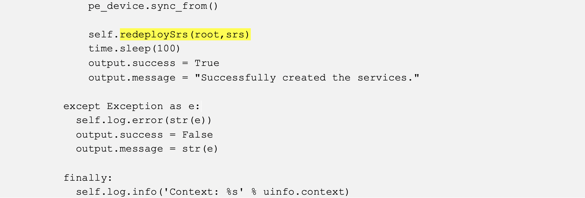

HOLOPS-1803
===========


Scenario 5.	(Optional) Create an NSO Action to Discover Pre-existing L2VPN Service Instances Automatically 
----------------------------------------------------------------------------------------------------

In previous scenarios, you learned to discover pre-existing service configurations manually. As one can see, manually creating service instances to match all the attributes in pre-existing configurations is time consuming, tedious, and error prone. This approach does not scale for networks with a significant number of pre-existing services. To be able to support brownfield network service lifecycle management, we must be able to discover pre-existing services automatically.

There are several ways to auto-discover services. One of them is creating service instances from device model using NSO’s maapi and magic APIs, followed by resetting the ref-count for the service instances programmatically. 

In this scenario, you will learn how to create an NSO action to discover pre-existing L2VPN services through an NSO action.


**NOTE: This scenario requires Python programming experience and knowledge of the NSO maagic and maapi APIs.**

### Create package skeleton for reconcile action

In NSO, action callbacks are used to implement arbitrary operations in java or python. These operations can be basically anything, for example, downloading a file, performing some test, resetting alarms, and so on. We will create an action package, l2vpnreconcile, to perform L2Vpn service discovery. Although it can be easily extended, for simplicity, this lab designs the action to perform service discovery from one PE device. 

We will create the package skeleton first.

1. From NSO VM create a skeleton package, and
    name it `l2vpnreconcile`
    
   ```
   [nso@nso]$ mkdir -p ~/packages
   [nso@nso]$ cd ~/packages
   [nso@nso packages]$ ncs-make-package --service-skeleton python --action-example l2vpnreconcile
   [nso@nso packages]$ cd l2vpnreconcile
   [nso@nso l2vpnreconcile]$ ls
   package-meta-data.xml python README src templates test
   ```
   
2.	Enter the following command to return to the nso@nso prompt.

	```
	[nso@nso l2vpnreconcile]$ cd
	[nso@nso ~]$
	```
   
### Update l2vpnreconcile.yang file

Action `l2vpnreconcile` has one input parameter, the PE that we wish to reconcile the L2Vpn service from. The action has two output parameters, `success` (boolean) and `message` (string), for discovery result, and a message associated with the status of the operation. You will modify the auto-generated yang file to capture the input and output parameters.

**Option 1: Edit `~/packages/l2vpnreconcile/src/yang/l2vpnreconcile.yang` from NSO server,
use `vi` for example;**

**Option 2: At the `[nso@nso ~]$ `prompt, enter `code ~/packages/l2vpnreconcile/src/yang/l2vpnreconcile.yang` This automatically launches the file in Visual Studio Code You can edit the file directly in Visual Studio Code.**

1. Delete the service portion of the l2vpnreconcile.yang file (lines #39 to #63).

	
 
1. As shown below, action reconcile-l2vpn is under a container action.
	

4.	On line #25, change the generated generic action name `double` to `reconcile-l2vpn`, and actionpoint `l2vpnreconcile-action` to `reconcile` (on line #26). 

5.	Replace the input block (lines #27 to #31) with the following input parameter (`device-name`). 

	```
	input {
          leaf device-name {
            type leafref {
              path "/ncs:devices/ncs:device/ncs:name" ;
            }
        }
    ```
6.	Replace output block (lines #35 to #39) with the following output parameters (`message` , `success`). 
	```
    output {
         leaf message {
           type string;
         }
         leaf success {
           type boolean;
         }
    }
	```
7.	The complete contents of l2vpnreconcile.yang should look like the following. Correct any errors before you proceed.		

    
    ```
    module l2vpnreconcile {

      namespace "http://example.com/l2vpnreconcile";
      prefix l2vpnreconcile;

      import ietf-inet-types { prefix inet; }
      import tailf-common { prefix tailf; }
      import tailf-ncs { prefix ncs; }

      description
        "Bla bla...";

      revision 2016-01-01 {
        description
          "Initial revision.";
      }

      container action {
        tailf:action reconcile-l2vpn {
        tailf:actionpoint reconcile;
        input {
          leaf device-name {
            type leafref {
              path "/ncs:devices/ncs:device/ncs:name" ;
            }
        }
       }
       output {
         leaf message {
           type string;
         }
         leaf success {
           type boolean;
         }
        }
       }
      }
    }

    ```
    **NOTE: Refer to `~/solution/l2vpnreconcile/src/yang/l2vpnreconcile.yang` for reference..**

1.  Save l2vpnreconcile.yang. 
9.	Compile the package l2vpnreconcile to check if the yang file has any syntax error. Make sure that there are no errors.
	```
	[nso@nso ~]$ cd ~/packages
	[nso@nso packages]$ cd ~/packages/l2vpnreconcile/src
	[nso@nso src]$ make clean all
	rm -rf ../load-dir java/src//
	mkdir -p ../load-dir
	mkdir -p java/src//
	....
	....
	[nso@nso src]$
	```
10.	Enter the following command to return to the nso@nso prompt.

    ```
	[nso@nso src]$ cd
	[nso@nso ~]$
	```


### Update Python Script main.py for Service Discovery and Reconciliation

We will update the auto generated python file main.py to perform L2Vpn service discovery and reconciliation. The objective is to create L2Vpn service instances from device model and reset the reference count of the service instances.

Creating service instances from a device model is a reverse process as compared to creating a service package: mapping device NED attributes to service attributes.

After a sync-from operation, the pre-existing configurations are brought into NSO’s device model. To create L2Vpn service instances, open a write transaction of cdb (the internal NSO in memory database), walk through the device model, populate service instance attributes, and commit the service instances to cdb.

### The Logic Flow

The logic flow is illustrated as pseudo code 

**Flow of Create and Reconcile L2VPN Services**

  ```
  1.  Start write transaction of cdb 
  2.  From cdb device model, get all Bundle-Ether-subinterfaces of the pe-device (passed in as input parameter of the action)
  3.  For each Bundle-Ether-subinterface:
      a.  Get the Bundle-Ether-subinterface id (formate as x.y, where x is Bundle-Ether port y represents the sub-interface id)
      b.  Parse the Bundle-Ether-subinterface id to get Bundle-Ether port number (x) and Bundle-Ether sub-interface id (y)
      c.  Get description, this will be used for L2Vpn service instance name. 
      d.  Parse description to get customer name and order number
      e.  Get encapsulation dot1q vlan id
      f.  Create a L2Vpn service instance with:
          i.  sr-name: description-pe-device
          ii. pe-devices: the pe-device
          iii. pe-device port number: x
          iv. pe-device port stag: y
          v.  customer: customer name
          vi. order-number: order number 
  4.  Commit dry-run (expect empty output)
  5.  Commit the transaction with no-network (not touching devices) 
  6.  Reset reference count of the service instances (service re-deploy reconcile)
  
  ```

### The Code Snips of main.py
This section explains of the contents of main.py using code snips as examples. This is just for reference. No action is required.

1. The snip of starting write transaction of cdb: 
	
	
2.	The snip of get all Bundle-Ether-sub-interfaces of the pe-device: 
	
	
	For each Bundle Ether sub-interface in device config, create one L2Vpn service instance. Similar to manual service instance creation as in Scenario 3, we use device attributes to populate service instance attributes. Use the interface description plus the pe device name as the sr-name for an L2Vpn service instance. Parse the interface description to extract customer name and order number and set attributes order-number and customer-name.
	
	**Pre-existing Bundle Ether sub interface configuration:**
	
	
	**Parse them as:**
	
	
3.	The snip of parsing each Bundle-Ether sub interface
	
	
4.	The snip of creating PE node for the service instance and setting the attributes of Bundle Ether port number (id) and stag. 
	

5.	The snip of invoking a dry-run action to make sure the output is empty and committing the service instances. It invokes a helper function `isDryRunEmpty`
	
	
6.	The snip of resetting the reference count as we have done in Scenario 4 via the NCS CLI. It invokes a helper function `redeploySrs` to reset the reference count of the services.	
	

7.	The snip of the helper function `isDryRunEmpty`. 
	
	
8.	The snip of helper function `redeploySrs`. It performs the same operation via maapi. This is equivalent to what we have done in Scenario 4 via ncs cli.	
	
  
   
### Create Contents of main.py

1. The complete contents of `main.py` is available at: 
	[`main.py`](https://github.com/weiganghuang/holops-1803/blob/master/solution/l2vpnreconcile/python/l2vpnreconcile/main.py)
	
2.	Now we will replace the content with the main.py contents available from the solutions directory.

	```
	[nso@nso]$ cp ~/solution/l2vpnreconcile/python/l2vpnreconcile/main.py ~/packages/l2vpnreconcile/python/l2vpnreconcile/
	```
	

### Compile and Deploy Action package l2vpnreconcile

In this section, we will compile the action package and deploy to NSO at the NSO server.

1.  Compile the package `l2vpnreconcile`.

    ```
    [nso@nso packages]$ cd ~/packages/l2vpnreconcile/src
    [nso@nso src]$ make clean all
    ```
    
    Sample output:
    
    ```
    [nso@nso packages]$ cd ~/packages/l2vpnreconcile/src
    [nso@nso src]$ make clean all
    rm -rf ../load-dir java/src//
    mkdir -p ../load-dir
    mkdir -p java/src//
    /home/nso/ncs-5.0.1/bin/ncsc  `ls l2vpnreconcile-ann.yang  > /dev/null 2>&1 && echo "-a l2vpnreconcile-ann.yang"` \
              -c -o ../load-dir/l2vpnreconcile.fxs yang/l2vpnreconcile.yang
    [nso@nso src]$

    ```
**Make sure there are no compilation errors, nor package reload errors. Final version of files `l2vpnreconcile.yang` and `main.py` are available at `~/solution/l2vpnreconcile` directory for your reference. 
(`~/solution/l2vpnreconcile/src/yang/l2reconcile.yang`
and 
`~/solution/l2vpnreconcile/python/l2vpnreconcile/main.py`)**
    

1.  Add a symbolic link to `l2vpnreconcile` at `~/ncs-run/packages/`, and then reload packages from NCS CLI.
    
     
	 Create symbolic link
    ```
    [nso@nso src]$ cd ~/ncs-run/packages
    [nso@nso packages]$ ln -s /home/nso/packages/l2vpnreconcile/
    [nso@nso packages]$ ls -l
    ```
    
    Sample output:
    
    ```
    [nso@nso packages]$ ls -l
    total 0
    lrwxrwxrwx. 1 nso nso 48 Nov 26 00:40 cisco-iosxr -> /home/nso/ncs-4.5.0.1/packages/neds/cisco-iosxr/
    lrwxrwxrwx. 1 nso nso 25 Dec 11 23:08 L2Vpn -> /home/nso/packages/L2Vpn/
    lrwxrwxrwx. 1 nso nso 34 Dec 12 00:20 l2vpnreconcile -> /home/nso/packages/l2vpnreconcile/
 
    ```
    
    Reload NSO packages 
        
    ```
    [nso@nso packages]$ ncs_cli -u admin

    admin connected from 198.18.133.252 using ssh on nso
    admin@ncs> request packages reload
    ```
    
    Sample output:
    
    ```
    admin@ncs> request packages reload
    >>> System upgrade is starting.
    >>> Sessions in configure mode must exit to operational mode.
    >>> No configuration changes can be performed until upgrade has completed.
    >>> System upgrade has completed successfully.
    reload-result {
      package L2Vpn
      result true
    }
    reload-result {
      package cisco-iosxr
      result true
    }
    reload-result {
      package l2vpnreconcile
      result true
    }
    [ok][2018-12-09 09:16:12]
    ```

### Test the Action Script to Discover all Pre-existing L2VPN Services

In this section, you will run the reconcile-l2vpn action to discover the pre-existing L2VPN services in devices.

1.  Enter the following command to discover the L2VPN services for asr9k0. Note that it takes up to two minutes for the operation to complete.

    ```
    admin@ncs> request action reconcile-l2vpn device-name asr9k0
    ```
    
    Sample output:
    
    ```
    admin@ncs> request action reconcile-l2vpn device-name asr9k0
    message Successfully created the services.
    success true
    [ok][2020-06-03 11:38:21]
    admin@ncs>
    System message at 2020-06-03 11:38:21...
    Commit performed by admin via tcp using cli.

    ```
2.	Check the discovered L2Vpn services. Note that in service instance creation code, we set the description concatenated with device name as the service instance name.
    
    ```
    admin@ncs> admin@ncs> show services L2Vpn ?
    Possible completions:
    L_3m_318-L1111318-asr9k0           - Unique service name
    L_att_318-L1111318-asr9k0          - Unique service name
    L_comcast_318-L1111318-asr9k0      - Unique service name
    L_ford_318-L1111318-asr9k0         - Unique service name
    L_mckesson_318-L1111318-asr9k0     - Unique service name
    L_unitedhealth_318-L1111318-asr9k0 - Unique service name


    ………
    ```
    
    ```
    admin@ncs> conf
    admin@ncs% show services L2Vpn L_3m_318-L1111318-asr9k0
    order-number  L1111318;
    customer-name L_3m_318;
    pe-devices asr9k0 {
        Bundle-Ether 100;
        stag         276;
    }
    [ok][2018-12-09 09:43:31]

    [edit]

    ```

3.	Try to delete one of them to confirm that NSO is managing the lifecycle of reconciled services correctly.
    
    
    ```
    admin@ncs% delete services L2Vpn L_3m_318-L1111318-asr9k0
    [ok][2020-06-05 06:17:50]

    [edit]
    ```
    
    ```
    admin@ncs% commit dry-run outformat native
    native {
      device {
        name asr9k0
        data no interface Bundle-Ether 100.276 l2transport
      }
    }
    [ok][2020-06-05 06:17:57]

    [edit]

    ```

4.	Commit the delete performed in step 3. After that, we can see that the device configuration of Bundle-Ether 100.276 was deleted:
    ```
    admin@ncs% commit
    Commit complete.
    [ok][2020-12-30 13:12:49]

    [edit]
    ```
    
    ```
    admin@ncs% show devices device asr9k0 config cisco-ios-xr:interface Bundle-Ether-subinterface Bundle-Ether 100.276
    -----------------------------------------------------------------------------------------------------------^
    syntax error: element does not exist
    [error][2020-12-30 13:13:22]

    [edit]

    ```
1. Exit from ncs cli:

   ```
   admin@ncs% exit
   [ok][2019-06-06 14:27:07]
   admin@ncs> exit
   ```
**This concludes scenario 5.**
